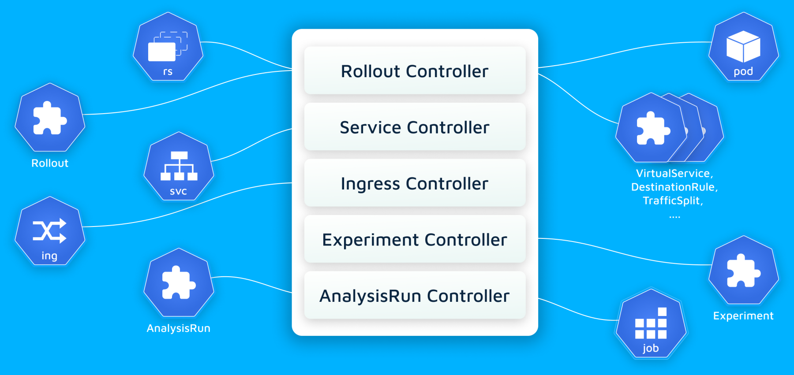

# Contributing
## Before You Start
Argo Rollouts is written in Golang. If you do not have a good grounding in Go, try out [the tutorial](https://tour.golang.org/).

## Pre-requisites
Install:

* [docker](https://docs.docker.com/install/#supported-platforms)
* [golang](https://golang.org/)
* [kubectl](https://kubernetes.io/docs/tasks/tools/#kubectl)
* [kustomize](https://github.com/kubernetes-sigs/kustomize/releases)
* [k3d](https://k3d.io/) recommended

Kustomize is required for unit tests (`make test` is using it), so you [must install it](https://kubectl.docs.kubernetes.io/installation/kustomize/)
locally if you wish to make code contributions to Argo Rollouts.

Argo Rollout additionally uses the following tools

* `golangci-lint` to lint the project.
* `protoc` and `swagger-codegen` to generate proto related files
* `yarn` to build the UI

Run the following commands to install them:

```bash
# macOS
brew install golangci-lint

# linux
go get -u github.com/golangci/golangci-lint/cmd/golangci-lint
```

Brew users can quickly install the lot:

```bash
brew install go kubectl kustomize golangci-lint protobuf swagger-codegen k3d
```

Set up environment variables (e.g. is `~/.bashrc`):

```bash
export GOPATH=~/go
export PATH=$PATH:$GOPATH/bin
```

Checkout the code:

```bash
go get -u github.com/argoproj/argo-rollouts
cd ~/go/src/github.com/argoproj/argo-rollouts
```

## Building

`go.mod` is used, so the `go build/test` commands automatically install the needed dependencies

The `make controller` command will build the controller.

* `make install-tools-local` - Runs scripts to install codegen utility CLIs necessary for codegen.

* `make codegen` - Runs the code generator that creates the informers, client, lister, and deepcopies from the types.go and modifies the open-api spec.


## Running Controller Locally

It is much easier to run and debug if you run Argo Rollout in your local machine than in the Kubernetes cluster.

```bash
cd ~/go/src/github.com/argoproj/argo-rollouts
go run ./cmd/rollouts-controller/main.go
```

When running locally it will connect to whatever kubernetes cluster you have configured in your kubeconfig. You will need to make sure to install the Argo Rollout CRDs into your local cluster, and have the `argo-rollouts` namespace.

## Running Unit Tests

To run unit tests:

```bash
make test
```

## Running E2E tests

The end-to-end tests need to run against a kubernetes cluster with the Argo Rollouts controller
running. The rollout controller can be started with the command:

```
make start-e2e
```

Start and prepare your cluster for e2e tests:

```
k3d cluster create
kubectl create ns argo-rollouts
kubectl apply -k manifests/crds
kubectl apply -f test/e2e/crds
```

Then run the e2e tests:

```
make test-e2e
```

To run a subset of e2e tests, you need to specify the suite with `-run`, and the specific test regex with `-testify.m`.

```
E2E_TEST_OPTIONS="-run 'TestCanarySuite' -testify.m 'TestCanaryScaleDownOnAbortNoTrafficRouting'" make test-e2e
```

## Controller architecture

Argo Rollouts is actually a collection of individual controllers
that handle a specific aspect of Progressive Delivery.

[](architecture-assets/internal-architecture.png)

The controllers are:

* [Rollout Controller](https://github.com/argoproj/argo-rollouts/blob/master/rollout/controller.go)
* [Service Controller](https://github.com/argoproj/argo-rollouts/blob/master/service/service.go)
* [Ingress Controller](https://github.com/argoproj/argo-rollouts/blob/master/ingress/ingress.go)
* [Experiment Controller](https://github.com/argoproj/argo-rollouts/blob/master/experiments/controller.go)
* [AnalysisRun Controller](https://github.com/argoproj/argo-rollouts/blob/master/analysis/controller.go)

### Tips

1. You can run the tests using a different kubeconfig by setting the `KUBECONFIG` environment variable:

```shell
KUBECONFIG=~/.kube/minikube make start-e2e
KUBECONFIG=~/.kube/minikube make test-e2e
```

2. To run a specific e2e test, set the `E2E_TEST_OPTIONS` environment variable to specify the test
(or test regex):

```shell
make test-e2e E2E_TEST_OPTIONS="-testify.m ^TestRolloutRestart$"
```

3. The e2e tests are designed to run as quickly as possible, eliminating readiness and termination
delays. However, it is often desired to artificially slow down the tests for debugging purposes,
as well as to understand what the test is doing. To delay startup and termination of pods, set the
`E2E_POD_DELAY` to an integer value in seconds. This environment variable is often coupled with
`E2E_TEST_OPTIONS` to debug and slow down a specific test.

```shell
make test-e2e E2E_POD_DELAY=10
```

4. Increasing the timeout. The E2E tests time out waiting on conditions to be met within 60 seconds.
If debugging the rollout controller, it may be useful to increase this timeout while say sitting
at a debugger breakpoint:

```shell
make test-e2e E2E_WAIT_TIMEOUT=999999
```


5. The e2e tests leverage a feature of the controller allowing the controller to be sharded with
a user-specific "instance id" label. This allows the tests to operate only on rollouts with the
specified label, and prevents any other controllers (including the system rollout controller),
from also operating on the same set of rollouts. This value can be changed (from the default of
`argo-rollouts-e2e`), using the `E2E_INSTANCE_ID` environment variable:

```shell
make start-e2e E2E_INSTANCE_ID=foo
make test-e2e E2E_INSTANCE_ID=foo
```

Alternatively, the e2e tests can be run against the system controller (i.e. without an instance id):

```shell
make start-e2e E2E_INSTANCE_ID=''
```


## Running Local Containers

You may need to run containers locally, so here's how:

Create login to Docker Hub, then login.

```bash
docker login
```

Add your username as the environment variable, e.g. to your `~/.bash_profile`:

```bash
export IMAGE_NAMESPACE=argoproj
```

Build the images:

```bash
DOCKER_PUSH=true make image
```

Update the manifests:

```bash
make manifests
```

Install the manifests:

```bash
kubectl -n argo-rollouts apply -f manifests/install.yaml
```

## Upgrading Kubernetes Libraries
Argo Rollouts has a dependency on the kubernetes/kubernetes repo for some of the functionality that has not been
pushed into the other kubernetes repositories yet. In order to import the kubernetes/kubernetes repo, all of the
associated repos have to pinned to the correct version specified by the kubernetes/kubernetes release. The
`./hack/update-k8s-dependencies.sh` updates all the dependencies to the those correct versions.

## Documentation Changes

Modify contents in `docs/` directory.

Preview changes in your browser by visiting http://localhost:8000 after running:

```shell
make serve-docs
```

To publish changes, run:

```shell
make release-docs
```
