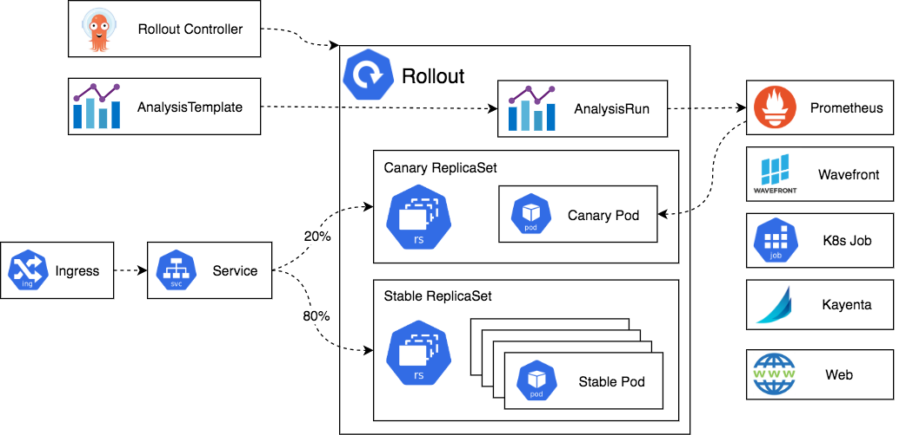

# Architecture

Here is an overview of all the components that take part in a deployment managed by Argo Rollouts.

## Argo Rollouts controller

This is the main controller that monitors the cluster for events and reacts whenever a resource of type `Rollout` is changed. The controller
will read all the details of the rollout and bring the cluster to the same state as described in the rollout definition.

Note that Argo Rollouts will not tamper with or respond to any changes that happen on normal [Deployment Resources](https://kubernetes.io/docs/concepts/workloads/controllers/deployment/). This means
that you can install Argo Rollouts in a cluster that is also deploying applications with alternative methods.

To install the controller in your cluster and get started with Progressive Delivery, see the [Installation page](../installation/).

## Rollout resource

The Rollout resource is a custom Kubernetes resource introduced and managed by Argo Rollouts. It is mostly compatible with the native Kubernetes Deployment resource but with extra
fields that control the stages, thresholds and methods of advanced deployment methods such as canaries and blue/green deployments.

Note that the Argo Rollouts controller will only respond to those changes that happen in Rollout sources. It will do nothing for normal deployment resources. This means that you need to [migrate your Deployments to Rollouts](../migrating/) if you want to manage them with Argo Rollouts.

You can see all possible options of a Rollout in the [full specification page](../features/specification/).

## Replica sets for old and new version

These are instances of the [standard Kubernetes ReplicaSet resources](https://kubernetes.io/docs/concepts/workloads/controllers/replicaset/). Argo Rollouts puts some extra metadata on them in order to keep track of the different versions that are part of an application.

Note also that the replica sets that take part in a Rollout are fully managed by the controller in an automatic way. You should not tamper with them with external tools.

## Ingress/Service

This is the mechanism that traffic from live users enters your cluster and is redirected to the appropriate version. Argo Rollouts use the [standard Kubernetes service resource](https://kubernetes.io/docs/concepts/services-networking/service/), but with some extra metadata needed for management.

Argo Rollouts is very flexible on networking options. First of all you can have different services during a Rollout, that go only to the new version, only to the old version or both.
Specifically for Canary deployments, Argo Rollouts supports several [service mesh and ingress solutions](../features/traffic-management/) for splitting traffic with specific percentages instead of simple balancing based on pod counts and it is possible to use multiple routing providers simultaneously.

## AnalysisTemplate and AnalysisRun

Analysis is the capability to connect a Rollout to your metrics provider and define specific thresholds for certain metrics that will decide if an update is successful or not. For each analysis you can define one or more metric queries along with their expected results. A Rollout will progress on its own if metric queries are good, rollback automatically if metrics show failure and pause the rollout if metrics cannot provide a success/failure answer.

For performing an analysis, Argo Rollouts includes two custom Kubernetes resources: `AnalysisTemplate` and `AnalysisRun`.

`AnalysisTemplate` contains instructions on what metrics to query. The actual result that is attached to a Rollout is the `AnalysisRun` custom resource. You can define an `AnalysisTemplate` on a specific Rollout or globally on the cluster to be shared by multiple rollouts as a `ClusterAnalysisTemplate`. The `AnalysisRun` resource is scoped on a specific rollout.

Note that using an analysis and metrics in a Rollout is completely optional. You can manually pause and promote a rollout or use other external methods (e.g. smoke tests) via the API or the CLI. You don't need a metric solution just to use Argo Rollouts. You can also mix both automated (i.e. analysis based) and manual steps in a Rollout.

Apart from metrics, you can also decide the success of a rollout by running a [Kubernetes job](../analysis/job/) or running [a webhook](../analysis/web/).

## Metric providers

Argo Rollouts includes [native integration for several popular metrics providers](../features/analysis/) that you can use in the Analysis resources to automatically promote or rollback  a rollout. See the documentation of each provider for specific setup options.

## CLI and UI (Not shown in the diagram)

You can view and manage Rollouts with the [Argo Rollouts CLI](../features/kubectl-plugin/) or the [integrated UI](../dashboard/). Both are optional.

