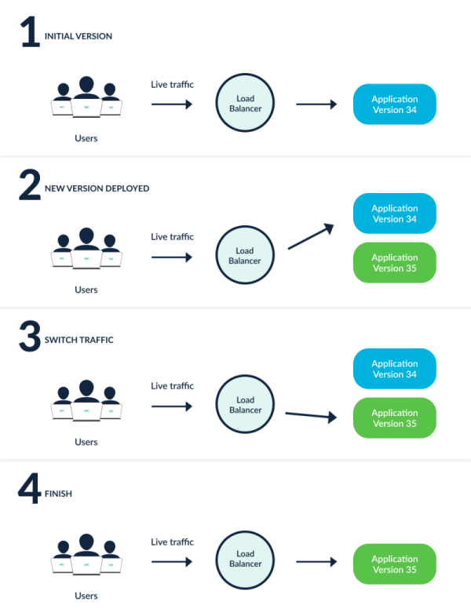
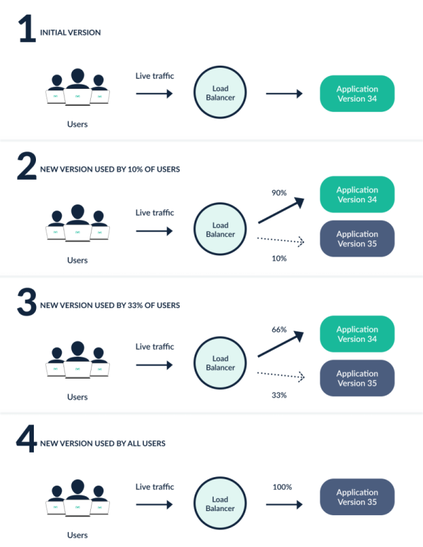

# Concepts

## Rollout

A Rollout is Kubernetes workload resource which is equivalent to a Kubernetes Deployment object.
It is intended to replace a Deployment object in scenarios when more advanced deployment or 
progressive delivery functionality is needed. A Rollout provides the following features which
a Kubernetes Deployment cannot:

* blue-green deployments
* canary deployments
* integration with ingress controllers and service meshes for advanced traffic routing
* integration with metric providers for blue-green & canary analysis
* automated promotion or rollback based on successful or failed metrics

## Progressive Delivery

Progressive delivery is the process of releasing updates of a product in a controlled and gradual
manner, thereby reducing the risk of the release, typically coupling automation and metric analysis
to drive the automated promotion or rollback of the update. 

Progressive delivery is often described as an evolution of continuous delivery, extending the
speed benefits made in CI/CD to the deployment process. This is accomplished by limiting the
exposure of the new version to a subset of users, observing and analyzing for correct behavior, 
then progressively increasing the exposure to a broader and wider audience while continuously
verifying correctness.

## Deployment Strategies

While the industry has used a consistent terminology to describe various deployment strategies, the implementations of these strategies tend to differ across tooling. To make it clear how the Argo Rollouts will behave, here are the descriptions of the various deployment strategies implementations offered by the Argo Rollouts.

### Rolling Update
A `RollingUpdate` slowly replaces the old version with the new version. As the new version comes up, the old version is scaled down in order to maintain the overall count of the application. This is the default strategy of the Deployment object.

### Recreate
A Recreate deployment deletes the old version of the application before bring up the new version. As a result, this ensures that two versions of the application never run at the same time, but there is downtime during the deployment.

### Blue-Green
A Blue-Green deployment (sometimes referred to as a Red-Black) has both the new and old version of the application deployed at the same time.  During this time, only the old version of the application will receive production traffic. This allows the developers to run tests against the new version before switching the live traffic to the new version.

### Canary
A Canary deployment exposes a subset of users to the new version of the application while serving the rest of the traffic to the old version. Once the new version is verified to be correct, the new version can gradually replace the old version. Ingress controllers and service meshes such as NGINX and Istio, enable more sophisticated traffic shaping patterns for canarying than what is natively available (e.g. achieving very fine-grained traffic splitting, or splitting based on HTTP headers).

The picture above shows a canary with two stages (10% and 33% of traffic goes to new version) but this is just an example. With Argo Rollouts you can define the exact number of stages
and percentages of traffic according to your use case.