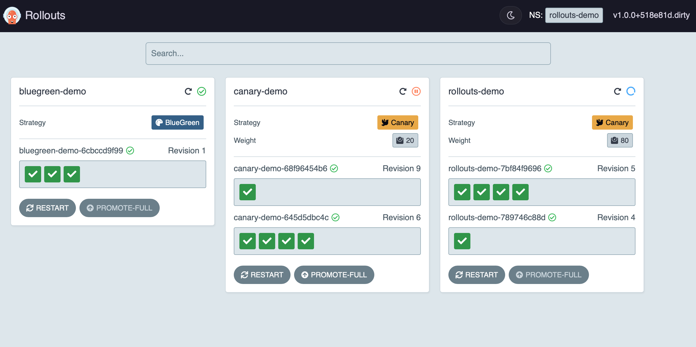
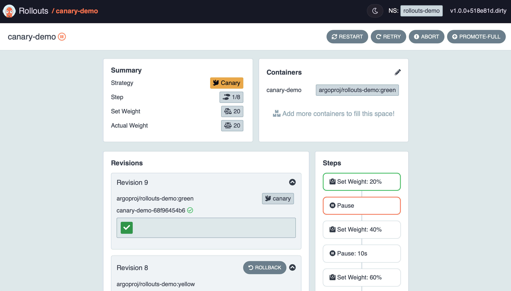

# UI Dashboard

The Argo Rollouts Kubectl plugin can serve a local UI Dashboard to visualize your Rollouts.

To start it, run `kubectl argo rollouts dashboard` in the namespace that contains your Rollouts.
Then visit `localhost:3100` to view the user interface.

## List view



## Individual Rollout view



## Authentication

By default the dashboard does not authenticate anyone. Every visitor acts with the credentials of
the kubeconfig the dashboard itself was started with. That is fine for `kubectl argo rollouts
dashboard` on a laptop, but it means anyone who can reach the port has the dashboard's own
permissions.

The `--auth-mode` flag selects between the two modes:

| Mode | Behaviour |
|------|-----------|
| `server` (default) | No authentication. All requests use the credentials the dashboard was started with. |
| `client` | Each user supplies their own Kubernetes bearer token. The dashboard talks to the API server as that user, so Kubernetes RBAC decides what they can see and do. |

```bash
kubectl argo rollouts dashboard --auth-mode client
```

In client mode the dashboard shows a login page. Paste a Kubernetes bearer token and the token is
stored in a session cookie scoped to the dashboard's path, which is sent with every API request
including the live-update streams. Closing the browser discards it; the **Logout** button in the
header clears it immediately.

The token is never validated by the dashboard itself — it is forwarded to the Kubernetes API
server, which decides whether it is valid. A rejected token leaves you on the login page with an
error.

### Obtaining a token

Create a service account, give it the permissions you want the user to have, and mint a token for
it. Tokens created this way are short-lived, which is what you want for a UI login.

```bash
kubectl create serviceaccount rollouts-viewer -n argo-rollouts

# a token valid for 8 hours
kubectl create token rollouts-viewer -n argo-rollouts --duration=8h
```

On clusters older than v1.24, or when you want a token that does not expire, create a
service-account token Secret instead:

```yaml
apiVersion: v1
kind: Secret
metadata:
  name: rollouts-viewer-token
  namespace: argo-rollouts
  annotations:
    kubernetes.io/service-account.name: rollouts-viewer
type: kubernetes.io/service-account-token
```

```bash
kubectl apply -f rollouts-viewer-token.yaml
kubectl get secret rollouts-viewer-token -n argo-rollouts -o jsonpath='{.data.token}' | base64 -d
```

A non-expiring token is a long-lived credential. Prefer `kubectl create token`.

You can also paste the token your own user already has, if your cluster issues one. `kubectl
config view --raw -o jsonpath='{.users[?(@.name=="<user>")].user.token}'` prints it when there is
one. Client certificates and exec-plugin credentials (EKS, GKE, OIDC via `kubectl oidc-login`)
cannot be pasted into the dashboard — those users need a service account token.

### RBAC

Read-only access to the dashboard:

```yaml
apiVersion: rbac.authorization.k8s.io/v1
kind: ClusterRole
metadata:
  name: rollouts-viewer
rules:
  - apiGroups: ["argoproj.io"]
    resources: ["rollouts", "analysisruns", "analysistemplates", "experiments"]
    verbs: ["get", "list", "watch"]
  - apiGroups: ["apps"]
    resources: ["replicasets"]
    verbs: ["get", "list", "watch"]
  - apiGroups: [""]
    resources: ["pods"]
    verbs: ["get", "list", "watch"]
```

A user bound only to the role above can browse Rollouts but gets a Kubernetes `403` if they try to
promote, abort, retry or restart one. To allow those actions, add:

```yaml
  - apiGroups: ["argoproj.io"]
    resources: ["rollouts"]
    verbs: ["update", "patch"]
```

Bind the role to the service account:

```bash
kubectl create clusterrolebinding rollouts-viewer \
  --clusterrole=rollouts-viewer \
  --serviceaccount=argo-rollouts:rollouts-viewer
```

The namespace dropdown is populated by listing Rollouts across all namespaces. A user without
cluster-wide list permission still gets a working dashboard, limited to the namespace the
dashboard was started in.

### Notes

- Serve the dashboard over HTTPS if it is reachable by anyone other than you. The token is sent on
  every request, and the cookie is only marked `Secure` when the page is loaded over HTTPS.
- The cookie is set with `SameSite=Strict`, so another site cannot make your browser issue
  authenticated requests to the dashboard.
- API clients that are not the browser should send `Authorization: Bearer <token>` instead; both
  are accepted.
