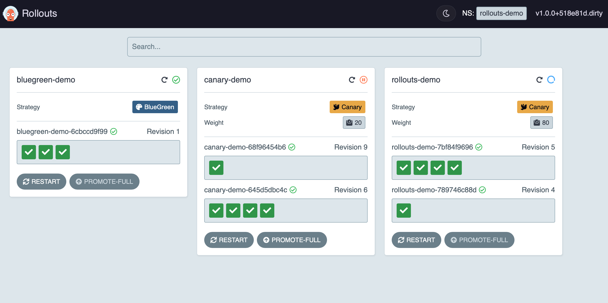
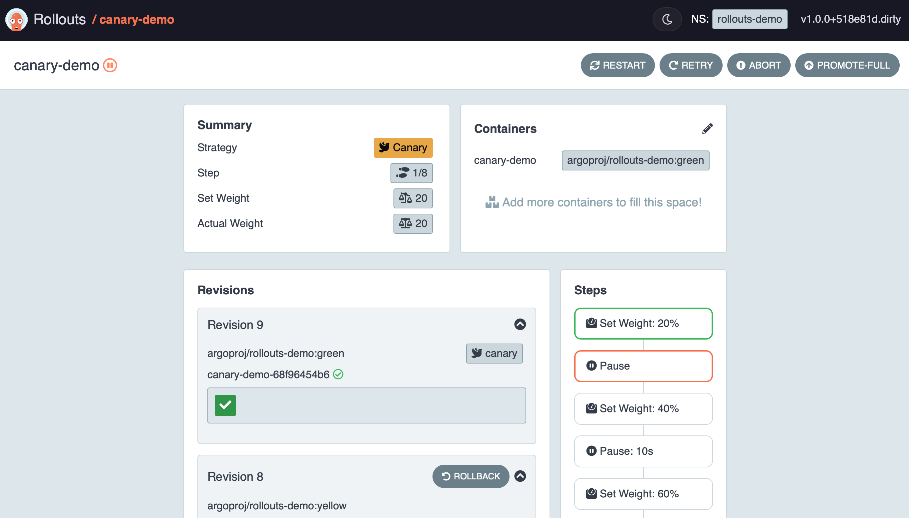

# UI Dashboard

The Argo Rollouts Kubectl plugin can serve a local UI Dashboard to visualize your Rollouts.

To start it, run `kubectl argo rollouts dashboard` in the namespace that contains your Rollouts.
Then visit `localhost:3100` to view the user interface.

!!! warning "Breaking change"
    The dashboard server now binds to `127.0.0.1` by default instead of
    `0.0.0.0`. Existing in-cluster deployments that expose the dashboard via a Kubernetes
    Service will stop being reachable after upgrading unless they explicitly pass
    `--address 0.0.0.0` to the dashboard command (the manifests bundled in this repo
    already set this).

## List view

## Individual Rollout view

