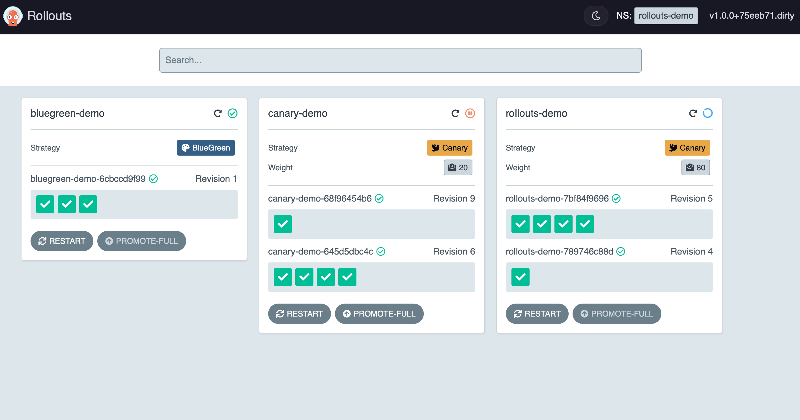
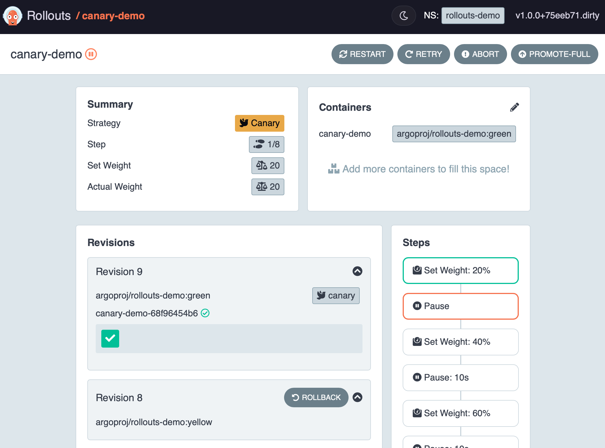

# UI Dashboard

The Argo Rollouts Kubectl plugin can serve a local UI Dashboard to visualize your Rollouts.

To start it, run `kubectl argo rollouts dashboard` in the namespace that contains your Rollouts.
Then visit `localhost:3100` to view the user interface.

## List view

## Individual Rollout view

