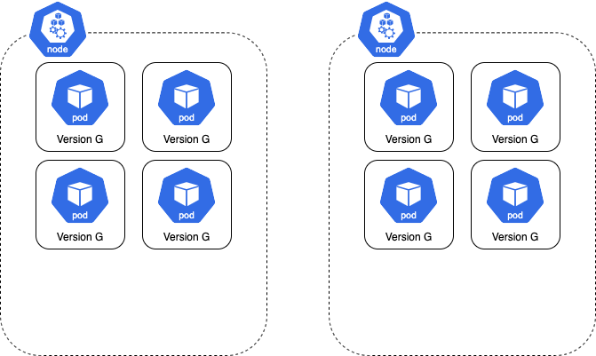
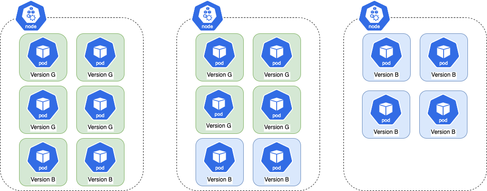
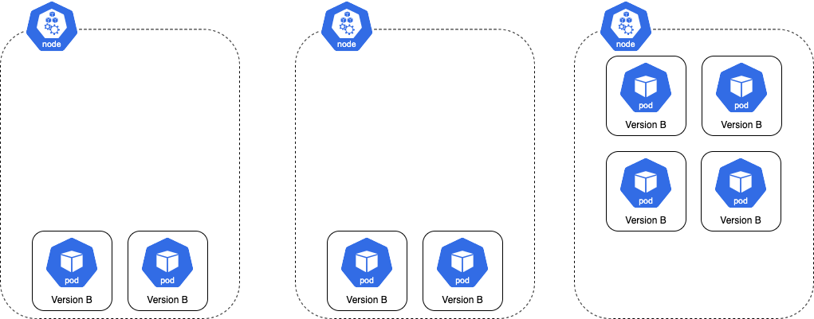
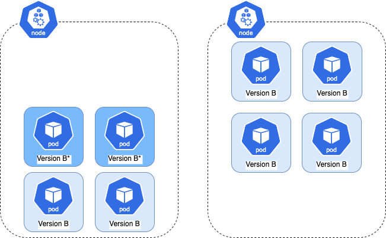
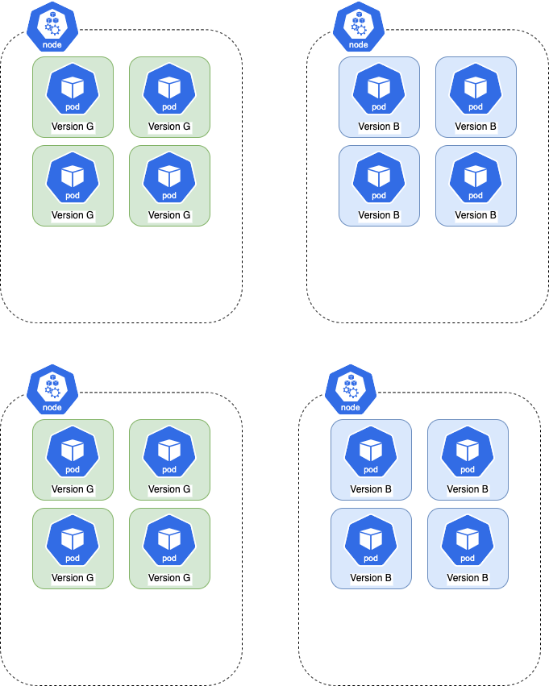

# Anti Affinity

## Background

Depending on a cluster's configuration, a Blue Green Rollout (or a Canary rollout that uses traffic management) can cause newly created pods to restart after deploying a new version. This can be problematic, especially for applications that cannot startup quickly or do not gracefully exit.


This behavior occurs because cluster auto-scaler wants to scale down the extra capacity which was created to support a Rollout
running in double capacity. When a node is scaled down, the pods it owns are deleted and recreated. This usually happens if a Rollout has its own dedicated instance group since a Rollout has a greater effect on
cluster auto-scaling. Therefore, clusters with a large pool of shared nodes experience the behavior less often.

For example, here is a Rollout is running with 8 pods spread across 2 nodes. Each node can hold 6 pods:


When the `spec.template` of the Rollout changes, the controller creates a new ReplicaSet with the spec update and the total number of pods doubles. In this case, the number of pods increases
to 16.

Since each node can only hold 6 pods, the cluster autoscaler must increase the node count to 3 to accommodate
all 16 pods. The resulting distribution of pods across nodes is shown here:


Once the Rollout finishes progressing, the old version is scaled down. This leaves the cluster with more nodes than necessary, thus wasting resources (as shown below).


The cluster auto-scaler terminates the extra node and the pods are rescheduled on the remaining 2 nodes.


To reduce the chance of this behavior, a rollout can inject anti-affinity into the ReplicaSet. This prevents new pods from running on nodes which have the previous version's pods.

You can learn more about anti-affinity [here](https://kubernetes.io/docs/concepts/configuration/assign-pod-node/#inter-pod-affinity-and-anti-affinity).

Repeating the above example with anti-affinity enabled, here is what happens when the `.spec.template` of the Rollout changes. Due to anti-affinity, the new pods cannot be scheduled on nodes which run the old ReplicaSet's pods.
As a result, the cluster auto-scaler must create 2 nodes to host the new ReplicaSet's pods. In this case, pods won't be started since the scaled-down nodes are guaranteed to not have the new pods.


## Enabling Anti-Affinity in Rollouts

Anti-affinity is enabled by adding the anti-affinity struct to the Blue-Green or Canary strategy. When the anti-affinity struct is set, controller injects a PodAntiAffinity struct into the ReplicaSet's Affinity.
This feature will not modify any of the ReplicaSet's pre-existing affinity rules. 

Users have a choice between these scheduling rules: `RequiredDuringSchedulingIgnoredDuringExecution` and `PreferredDuringSchedulingIgnoredDuringExecution`.

`RequiredDuringSchedulingIgnoredDuringExecution` requires a new version's pods to be on a separate node than the previous versions. If this
is not possible, the the new version's pods will not be scheduled.

```yaml
strategy:
    bluegreen:
      antiAffinity:
          requiredDuringSchedulingIgnoredDuringExecution: {}
```

Unlike the Required strategy, `PreferredDuringSchedulingIgnoredDuringExecution` does not force a new version's pods to be on a separate node than the previous versions.
The scheduler attempts to place the new version's pods on separate node(s). If that's not possible, the new version's pods will still be scheduled. The `Weight` is used to create a priority order for preferred anti-affinity rules. 

```yaml
strategy:
    canary:
      antiAffinity:
          preferredDuringSchedulingIgnoredDuringExecution:
            weight: 1 # Between 1 - 100
```

!!! important
    The main downside to this approach is that deployments can take longer because new nodes are more likely to be created in order to schedule pods with respect to anti-affinity rules. This delay most frequently occurs when a rollout has its own dedicated instance group,
    since new nodes are more likely to be created to honor anti-affinity rules.
