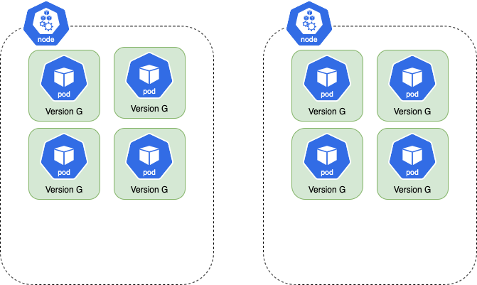
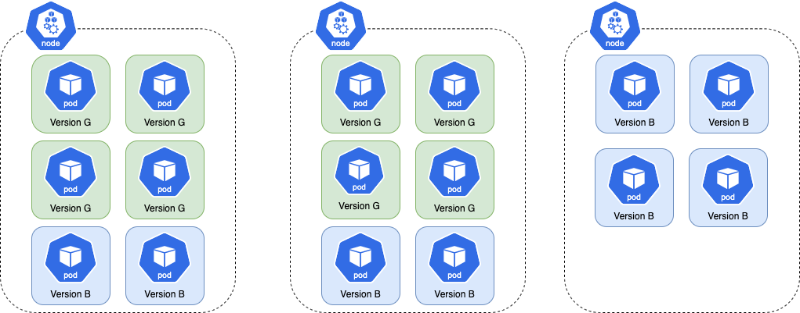
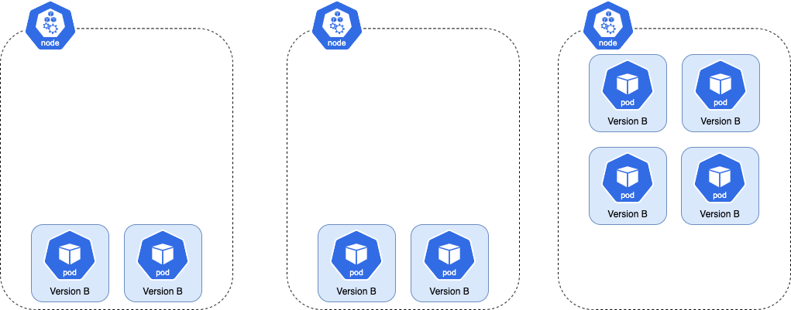
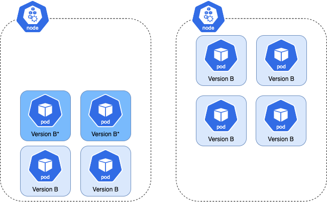
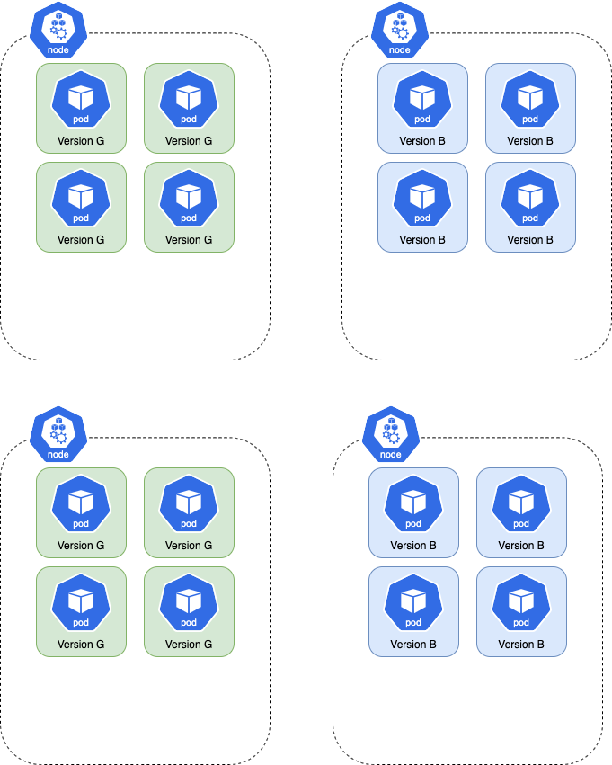

# Blue Green Anti Affinity

Depending on a cluster's configuration, a Blue Green rollout (or Canary rollout that keeps the old version scaled at 100%) can cause newly created pods to restart after ~10 minutes.

This can be problematic, especially for applications that cannot startup quickly or do not gracefully exit.

This behavior usually happens when a rollout has its own dedicated instance group since a rollout has a greater effect on
node auto-scaling. Therefore, clusters with a large pool of shared nodes experience the behavior less often.

This occurs because node auto-scaler wants to scale down the extra capacity which was created to support a rollout
running in double capacity. Here is a visual representation of the issue:

Here is a Rollout is running with 8 pods spread across two nodes. Each node can hold 6 pods:


When a new version is introduced, the total number of pods in the namespace doubles. In this case, the total increases
to 16. Since each node can only hold 6 pods, the cluster autoscaler must increase the node count to 3 to accommodate
the 4 extra pods. The resulting distribution of pods across nodes is shown here:

Once the rollout finishes progressing, the previous version is scaled down. This leaves the cluster over-provisioned, as shown below.

The node auto-scaler terminates the extra node and the pods are rescheduled on the 2 remaining nodes.


To reduce the likelihood of this behavior, a rollout can inject anti-affinity to prevent new pods from sharing a node with the previous version's pods.
Then, when the new version is introduced, the node auto-scaler must increase the node count by 2 since the new pods cannot be scheduled on nodes which have the previous version's pods.



Anti-affinity is enabled by adding the antiAffinity flag to the Blue-Green or Canary strategy, as shown below. It can be enabled for both Blue-Green and Canary Rollouts.

Users have a choice between RequiredDuringSchedulingIgnoredDuringExecution and PreferredDuringSchedulingIgnoredDuringExecution.

RequiredDuringSchedulingIgnoredDuringExecution requires a new version's pods to be on a separate node than the previous versions. If this
is not possible, the the new version's pods will not be scheduled.

```yaml
strategy:
    bluegreen:
      antiAffinity:
          requiredDuringSchedulingIgnoredDuringExecution: {}
```

PreferredDuringSchedulingIgnoredDuringExecution does not require a new version's pods to be on a separate node than the previous versions.
If the scheduler is unable to put the two versions on separate nodes, the new version's pods will still be scheduled.

```yaml
strategy:
    canary:
      antiAffinity:
          preferredDuringSchedulingIgnoredDuringExecution:
            weight: 1
```

The big downside to this approach is that deploys would take much longer because pods would always trigger scale-up to
fit the new stack on completely separate nodes.