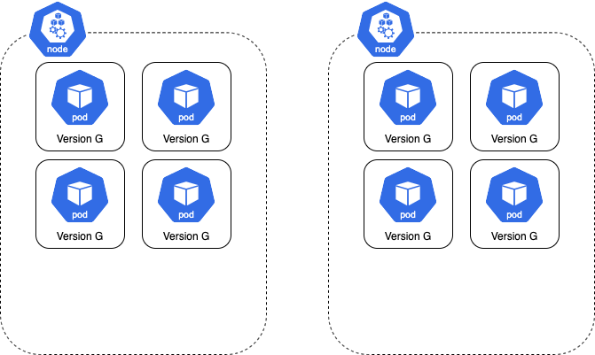
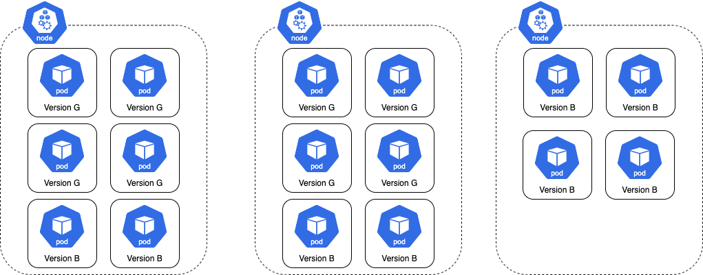
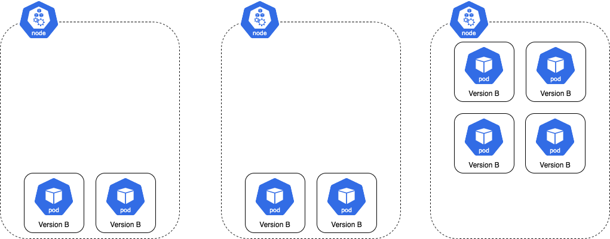
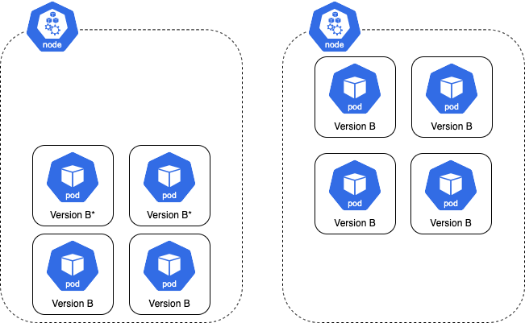
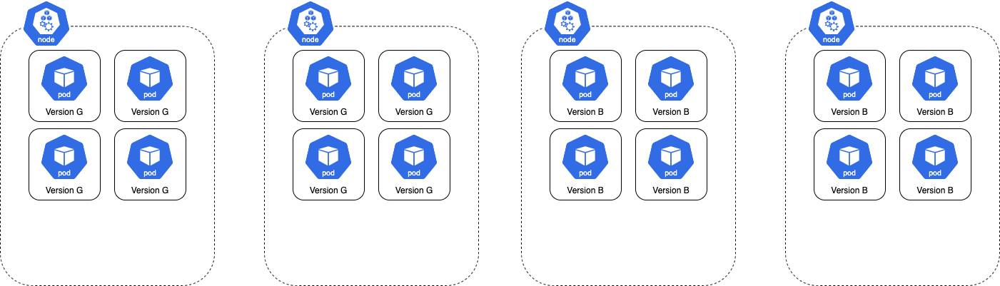

# Blue Green Anti Affinity

Depending on a cluster's configuration, a Blue Green rollout can cause newly created pods to restart after ~10 minutes.
This behavior usually occurs when a rollout has its own dedicated instance group since a rollout has a greater affect on
node auto-scaling. As a result, clusters with a large pool of shared nodes experience the behavior less often.
For applications that cannot startup quickly or do not gracefully exit, this behavior ends up being especially
problematic.

This behavior occurs because node auto-scaler wants to scale down the extra capacity created to support a rollout
running in double capacity. Here is a visual representation of the issue:

Here is a Rollout is running with 8 pods spread across two nodes where each node can hold 6 pods:

When a new version is introduced, the total number of pods in the namespace doubles. In this case, the total increases
to 16. Since each node can only hold 6 pods, the cluster autoscaler has to increase the node count to 3 to accommodate
the 4 extra pods. Resulting in a distribution like the following:

Once the rollout finishes progressing, the previous version is scaled down leaving the cluster over-provisioned.

The node auto-scaler terminates the extra node and the pods are rescheduled on the remaining nodes.

A rollout can inject node anti-affinity to prevent new pods from sharing a node with the previous ones to help reduce
the likely of this behavior from happening. When a new version is introduced, the node auto-scaler has to increase the
node count by 2 since the scheduler cannot schedule the pods on the nodes using the previous version.

The big downside to this approach is that deploys would take much longer because pods would always trigger scale-up to
fit the new stack on completely separate nodes.

