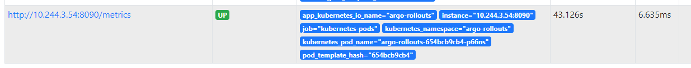
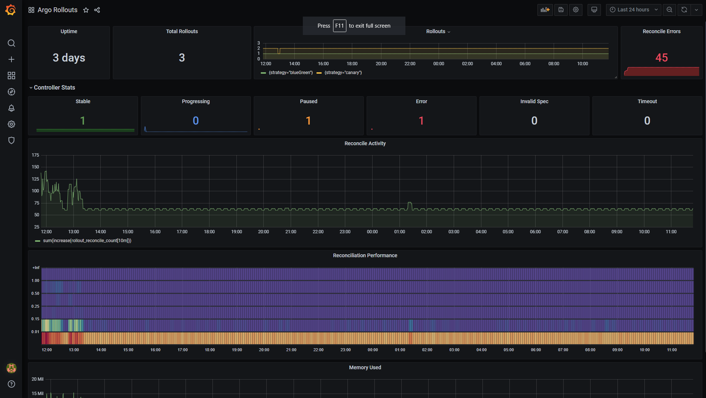

# Controller Metrics

The Argo Rollouts controller is already instrumented with [Prometheus metrics](https://prometheus.io/) available at `/metrics` in port 8090. You can use these metrics to look at the health of the controller either via dashboards or via other Prometheus integrations.


## Installing and configuring Prometheus

To take advantage of the metrics you need to have Prometheus installed in your Kubernetes cluster. If you don't have an existing installation of Prometheus
you can use any of the common methods to install it in your cluster. Popular options include the [Prometheus Helm chart](https://github.com/prometheus-community/helm-charts) or the [Prometheus Operator](https://prometheus-operator.dev/).

Once Prometheus is running in your cluster you need to make sure that it scrapes the Argo Rollouts endpoint. Prometheus already contains a service discovery mechanism
for Kubernetes, but you need to [configure it first](https://prometheus.io/docs/prometheus/latest/configuration/configuration/#kubernetes_sd_config). Depending on your installation method you might need to take additional actions to scrape the Argo Rollouts endpoint.

For example, if you used the Helm chart of Prometheus you need to annotate your Argo Rollouts Controller with the following:

```yaml
spec:
  template:
    metadata:
      annotations:
        prometheus.io/scrape: "true"
        prometheus.io/path: /metrics
        prometheus.io/port: "8090"
```

You can always see if the controller is reached successfully in the Prometheus "Targets" screen:

[](controller-metrics-assets/prometheus-target.png)

Once the controller metrics are read by your Prometheus instance, you can use them like any other Prometheus data source.

## Creating Grafana Dashboards

You can easily visualize the metrics from the controller using [Grafana](https://grafana.com/) dashboards. [Install Grafana](https://grafana.com/docs/grafana/latest/installation/kubernetes/) in your cluster and [connect it your Prometheus instance](https://prometheus.io/docs/visualization/grafana/).
Then you can create any dashboard by using the available metrics (described in detail in the next sections).

As a starting point you can find an existing dashboard at [https://github.com/argoproj/argo-rollouts/blob/master/examples/dashboard.json](https://github.com/argoproj/argo-rollouts/blob/master/examples/dashboard.json)

[](controller-metrics-assets/argo-rollouts-metrics.png)

You can import this Dashboard in your Grafana installation [as a JSON file](https://grafana.com/docs/grafana/latest/dashboards/export-import/#importing-a-dashboard).


## Available metrics for Rollout Objects

The Argo Rollouts controller publishes the following prometheus metrics about Argo Rollout objects.

| Name                                | Description |
|-------------------------------------| ----------- |
| `rollout_info`                      | Information about rollout. |
| `rollout_info_replicas_available`   | The number of available replicas per rollout. |
| `rollout_info_replicas_unavailable` | The number of unavailable replicas per rollout. |
| `rollout_info_replicas_desired`     | The number of desired replicas per rollout. |
| `rollout_info_replicas_updated`     | The number of updated replicas per rollout. |
| `rollout_phase`                     | [**DEPRECATED - use rollout_info**] Information on the state of the rollout. |
| `rollout_reconcile`                 | Rollout reconciliation performance. |
| `rollout_reconcile_error`           | Error occurring during the rollout. |
| `experiment_info`                   | Information about Experiment. |
| `experiment_phase`                  | Information on the state of the experiment. |
| `experiment_reconcile`              | Experiments reconciliation performance. |
| `experiment_reconcile_error`        | Error occurring during the experiment. |
| `analysis_run_info`                 | Information about analysis run. |
| `analysis_run_metric_phase`         | Information on the duration of a specific metric in the Analysis Run. |
| `analysis_run_metric_type`          | Information on the type of a specific metric in the Analysis Runs. |
| `analysis_run_phase`                | Information on the state of the Analysis Run. |
| `analysis_run_reconcile`            | Analysis Run reconciliation performance. |
| `analysis_run_reconcile_error`      | Error occurring during the analysis run. |

## Available metrics for the controller itself

The controller also publishes the following Prometheus metrics to describe the controller health.

| Name                                          | Description |
| --------------------------------------------- | ----------- |
| `controller_clientset_k8s_request_total`      | Number of kubernetes requests executed during application reconciliation. |
| `workqueue_adds_total`                        | Total number of adds handled by workqueue |
| `workqueue_depth`                             | Current depth of workqueue |
| `workqueue_queue_duration_seconds`            | How long in seconds an item stays in workqueue before being requested. |
| `workqueue_work_duration_seconds`             | How long in seconds processing an item from workqueue takes. |
| `workqueue_unfinished_work_seconds`           | How many seconds of work has done that is in progress and hasn't been observed by work_duration. Large values indicate stuck threads. One can deduce the number of stuck threads by observing the rate at which this increases. |
| `workqueue_longest_running_processor_seconds` | How many seconds has the longest running processor for workqueue been running |
| `workqueue_retries_total`                     | Total number of retries handled by workqueue |

In addition, the Argo-rollouts offers metrics on CPU, memory and file descriptor usage as well as the process start time and memory stats of current Go processes.
