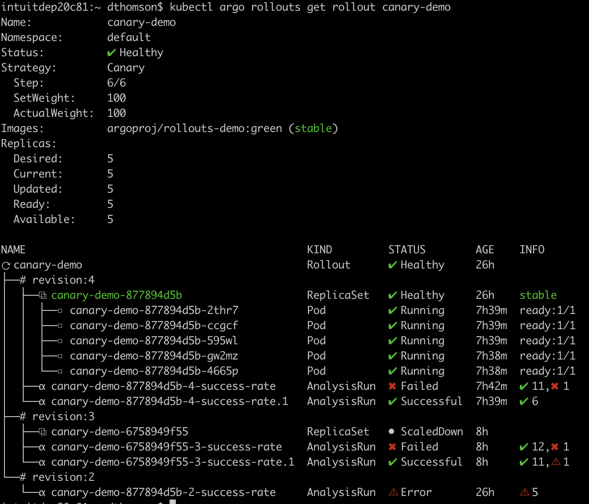

# Kubectl Plugin
Kubectl plugins are a way to extend the kubectl command to provide additional behavior. Generally, they are used to add new functionality to kubectl and automate scriptable workflows against a cluster. The official documentation on them is [here](https://kubernetes.io/docs/tasks/extend-kubectl/kubectl-plugins/).

Argo Rollouts offers a Kubectl plugin to enrich the experience with Rollouts, Experiments, and Analysis from the command line. It offers the ability to visualize the Argo Rollouts resources and run routine operations like promote or retry on those resources from the command.

## Installation

See the [installation guide](../installation.md) for instructions on installing the plugin.

## Usage
The best way to get information on the available Argo Rollouts kubectl plugin commands is by run `kubectl argo rollouts`. The plugin lists all the available commands that the tool can execute along with a description of each commend. All the plugin's commands interact with the Kubernetes API server and use KubeConfig credentials for authentication. Since the plugin leverages the KubeConfig of the user running the command, the plugin has the permissions of those configs. 

Similar to kubectl, the plugin uses many of the same flags as the kubectl. For example, the `kubectl argo rollouts get rollout canary-demo -w` command starts a watch on the `canary-demo` rollout object similar to how the `kubectl get deployment canary-demo -w` command starts a watch on a deployment.

## Visualizing Rollouts and Experiments
In addition to encapsulating many routine commands, the Argo Rollouts kubectl plugin supports visualizing rollouts and experiments with the get command. The get command provides a clean representation of either the rollouts or the experiments running in a cluster. It returns a bunch of metadata on a resource and a tree view of the child resources created by the parent. As an example, here is a rollout retrieved with a get command:

Here is a table to explain some of the icons on the tree view:

| Icon | Kind |
|:----:|:-----------:|
| ⟳ | Rollout |
| Σ | Experiment |
| α | AnalysisRun |
| # | Revision |
| ⧉ | ReplicaSet |
| □ | Pod |
| ⊞ | Job |

If the get command includes the watch flag (`-w` or `--watch`), the terminal updates as the rollouts or experiment progress highlighting the progress.