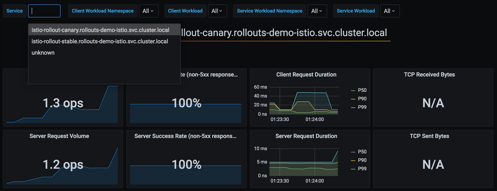
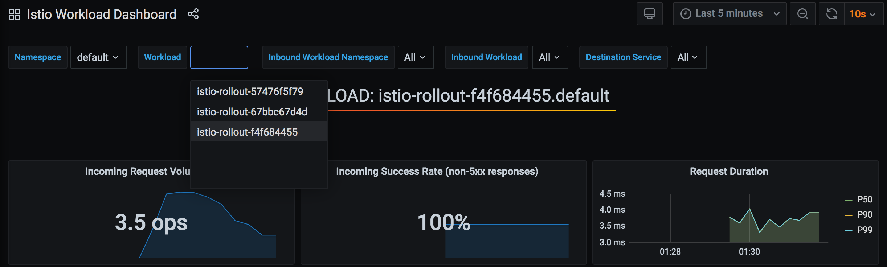

# Istio

[Istio](https://istio.io/) is a service mesh that offers a rich feature-set to control the flow of
traffic to a web service. Istio offers this functionality through a set of CRDs, and Argo Rollouts
automates the management of these resources to provide advanced traffic shaping capabilities to the
different versions of the Rollout during an update.

## How it works

Traffic splitting is accomplished in Istio by adjusting traffic weights defined in an 
[Istio VirtualService](https://istio.io/latest/docs/reference/config/networking/virtual-service/).
When using Argo Rollouts with Istio, a user deploys a VirtualService containing at least one
[HTTP route](https://istio.io/latest/docs/reference/config/networking/virtual-service/#HTTPRoute) containing two
[HTTP route destinations](https://istio.io/latest/docs/reference/config/networking/virtual-service/#HTTPRouteDestination):
a route destination targeting the pods of canary ReplicaSet, and a route destination targeting the pods
stable ReplicaSet. Istio provides two approaches for weighted traffic splitting, both approaches
are available as options in Argo Rollouts:

1. [Host-level traffic splitting](#host-level-traffic-splitting)
2. [Subset-lvel traffic splitting](#subset-level-traffic-splitting)

## Host-level Traffic Splitting

The first approach to traffic splitting using Argo Rollouts and Istio, is splitting between two
hostnames, or Kubernetes Services: a canary Service and a stable Service. This approach is
similar to the way all other Argo Rollouts mesh/ingress-controller integrations work (e.g. ALB, SMI,
Nginx). Using this approach, the user is required to deploy the following resources:

* Rollout
* Service (canary)
* Service (stable)
* VirtualService

The Rollout should define the following fields:

```yaml
apiVersion: argoproj.io/v1alpha1
kind: Rollout
metadata:
  name: rollout-example
spec:
  ...
  strategy:
    canary:
      canaryService: canary-svc  # required
      stableService: stable-svc  # required
      trafficRouting:
        istio:
          virtualService: 
            name: rollout-vsvc   # required
            routes:
            - primary            # required
      steps:
      - setWeight: 5
      - pause:
          duration: 10m
```

The VirtualService must contain an HTTP route with a name referenced in the Rollout, containing
two route destinations with `host` values that match the `canaryService` and `stableService` 
referenced in the Rollout.  If the VirtualService is defined in a different namespace than the rollout,
its name should be `rollout-vsvc.<vsvc namespace name>`. Note that Istio requires that all weights add to
100, so the initial weights can be be 100% to stable, and 0% to canary.

```yaml
apiVersion: networking.istio.io/v1alpha3
kind: VirtualService
metadata:
  name: rollout-vsvc
spec:
  gateways:
  - istio-rollout-gateway
  hosts:
  - istio-rollout.dev.argoproj.io
  http:
  - name: primary        # referenced in canary.trafficRouting.istio.virtualService.routes
    route:
    - destination:
        host: stable-svc # referenced in canary.stableService
      weight: 100
    - destination:
        host: canary-svc # referenced in canary.canaryService
      weight: 0
```

Finally, a canary and stable Service should be deployed. The selector of these Services will be
modified by the Rollout during an update to target the canary and stable ReplicaSet pods.
Note that if virtualservice and destionation host reside in different namespaces (e.g., virtualservice and rollout are not in the same namespace), we should use FQDN as the destination host like `stable-svc.<namespace>`.

```yaml
apiVersion: v1
kind: Service
metadata:
  name: canary-svc
spec:
  ports:
  - port: 80
    targetPort: http
    protocol: TCP
    name: http
  selector:
    app: rollouts-demo
    # This selector will be updated with the pod-template-hash of the canary ReplicaSet. e.g.:
    # rollouts-pod-template-hash: 7bf84f9696
---
apiVersion: v1
kind: Service
metadata:
  name: stable-svc
spec:
  ports:
  - port: 80
    targetPort: http
    protocol: TCP
    name: http
  selector:
    app: rollouts-demo
    # This selector will be updated with the pod-template-hash of the stable ReplicaSet. e.g.:
    # rollouts-pod-template-hash: 123746c88d
```

During the lifecycle of a Rollout update, Argo Rollouts will continuously:
* modify the canary Service `spec.selector` to contain the `rollouts-pod-template-hash` label of the canary ReplicaSet
* modify the stable Service `spec.selector` to contain the `rollouts-pod-template-hash` label of the stable ReplicaSet
* modify the VirtualService `spec.http[].route[].weight` to match the current desired canary weight

!!! note

    Rollout does not make any other assumptions about the fields within the Virtual Service or the Istio mesh. The user could specify additional configurations for the virtual service like URI rewrite rules on the primary route or any other route if desired. The user can also create specific destination rules for each of the services. 


## Subset-level Traffic Splitting

!!! important

    Available since v1.0

The second approach to traffic splitting using Argo Rollouts and Istio, is splitting between two
Istio [DestinationRule Subsets](https://istio.io/latest/docs/reference/config/networking/destination-rule/#Subset):
a canary subset and a stable subset. When splitting by DestinationRule subsets, the user is
required to deploy the following resources:

* Rollout
* Service
* VirtualService
* DestinationRule

The Rollout should define the following fields:

```yaml
apiVersion: argoproj.io/v1alpha1
kind: Rollout
metadata:
  name: rollout-example
spec:
  ...
  strategy:
    canary:
      trafficRouting:
        istio:
          virtualService: 
            name: rollout-vsvc        # required
            routes:
            - primary                 # required
          destinationRule:
            name: rollout-destrule    # required
            canarySubsetName: canary  # required
            stableSubsetName: stable  # required
      steps:
      - setWeight: 5
      - pause:
          duration: 10m
```

A single service should be defined, which target the Rollout pods. Note that unlike the first
approach, where traffic splitting is against multiple Services which are modified to contain the
rollout-pod-template-hash of the canary/stable ReplicaSets, this Service is not modified by
the rollout controller.

```yaml
apiVersion: v1
kind: Service
metadata:
  name: rollout-example
spec:
  ports:
  - port: 80
    targetPort: http
    protocol: TCP
    name: http
  selector:
    app: rollout-example
```

The VirtualService must contain an HTTP route with a name referenced in the Rollout, containing
two route destinations with `subset` values that match the `canarySubsetName` and `stableSubsetName` 
referenced in the Rollout. Note that Istio require that all weights add to 100, so the initial
weights can be be 100% to stable, and 0% to canary.

```yaml
apiVersion: networking.istio.io/v1alpha3
kind: VirtualService
metadata:
  name: rollout-vsvc
spec:
  gateways:
  - istio-rollout-gateway
  hosts:
  - istio-rollout.dev.argoproj.io
  http:
  - name: primary       # referenced in canary.trafficRouting.istio.virtualService.routes
    route:
    - destination:
        host: rollout-example
        subset: stable  # referenced in canary.trafficRouting.istio.destinationRule.stableSubsetName
      weight: 100
    - destination:
        host: rollout-example
        subset: canary  # referenced in canary.trafficRouting.istio.destinationRule.canarySubsetName
      weight: 0
```

Finally, the DestinationRule containing the canary and stable subsets referenced in the Rollout.

```yaml
apiVersion: networking.istio.io/v1alpha3
kind: DestinationRule
metadata:
  name: rollout-destrule
spec:
  host: rollout-example
  subsets:
  - name: canary   # referenced in canary.trafficRouting.istio.destinationRule.canarySubsetName
    labels:        # labels will be injected with canary rollouts-pod-template-hash value
      app: rollout-example
  - name: stable   # referenced in canary.trafficRouting.istio.destinationRule.stableSubsetName
    labels:        # labels will be injected with canary rollouts-pod-template-hash value
      app: rollout-example
```

During the lifecycle of a Rollout using Istio DestinationRule, Argo Rollouts will continuously:
* modify the VirtualService `spec.http[].route[].weight` to match the current desired canary weight
* modify the DestinationRule `spec.subsets[].labels` to contain the `rollouts-pod-template-hash`
  label of the canary and stable ReplicaSets


## Comparison Between Approaches

There are some advantages and disadvantages of host-level traffic splitting vs. subset-level traffic
splitting.

### DNS requirements

With host-level splitting, the VirtualService requires different `host` values to split among the
two destinations. However, using two host values implies that there are different DNS names. For
north-south traffic, which reach the service through the Istio Gateway, having multiple DNS names to
reach the canary vs. stable pods may not matter. However, for east-west traffic that happen inside
the cluster, it forces microservice-to-microservice communication to choose whether to hit the
stable or the canary DNS name, go through the gateway, or add DNS entries for the virtualservices.
In this situation, the DestinationRule subset traffic splitting would be a better option for
intra-cluster canarying.

### Metrics

Depending on the choice of host-level splitting vs. subset-level splitting, there will be different
styles of prometheus metrics available. For example, if using host-level splitting, the metrics of
the canary vs. stable would appear in the Istio Service metrics dashboard:



On the other hand, when splitting via subsets, it would be necessary to query prometheus using
different parameters, such as the workload name:



## Integrating with GitOps

Earlier it was explained that VirtualServices should be deployed with an initial canary and stable
weight of 0 and 100, respectively, such as in the following example:

```yaml
  http:
  - name: primary
    route:
    - destination:
        host: stable-svc
      weight: 100
    - destination:
        host: canary-svc
      weight: 0
```

This introduces a problem for users practicing GitOps. Since a Rollout will modify these
VirtualService weights as the Rollout progresses through its steps, it unfortunately causes the
VirtualService to become OutOfSync with the version in git. Additionally, if the VirtualService in
git were to be applied while the Rollout is in this state (splitting traffic between the services),
the apply would revert the weights back to the values in git (i.e. 100 to stable, 0 to canary).

One protection which is implemented in Argo Rollouts, is that it continually watches for changes to
managed VirtualServices. In the event that a `kubectl apply` were to happen using the VirtualService
in git, the change would be detected immediately by the rollout controller, and the controller will
instantly set the VirtualService weights back to the canary weight appropriate for the given step of
the Rollout. But since there is momentary flapping of weights, this behavior should be understood.

Some best practices to follow when using Argo CD with Argo Rollouts to prevent this behavior, is to
leverage the following Argo CD features:

1. Configure the application to ignore differences in the VirtualService. e.g.:

    ```yaml
    apiVersion: argoproj.io/v1alpha1
    kind: Application
    metadata:
      name: guestbook
    spec:
      ignoreDifferences:
      - group: networking.istio.io
        kind: VirtualService
        jsonPointers:
        - /spec/http/0
    ```

    Ignoring the differences in the VirtualServices HTTP route, prevents gitops differences
    in the VirtualService HTTP routes to contribute to the overall sync status of the Argo CD
    application. This adds the additional benefit of prevent auto-sync operations from being
    triggered.

2. Configure the Application to only apply OutOfSync resources:

    ```yaml
    apiVersion: argoproj.io/v1alpha1
    kind: Application
    metadata:
      name: guestbook
    spec:
      syncPolicy:
        syncOptions:
        - ApplyOutOfSyncOnly=true
    ```

    By default, when Argo CD  syncs an application, it runs `kubectl apply` against all resources in
    git which are part of the application. The `ApplyOutOfSyncOnly=true` sync option indicates to
    Argo CD to skip applying resources which it already considers `Synced`, and only apply the ones
    which are `OutOfSync`. This option, when used in conjunction with the `ignoreDifferences`
    feature, provides a way to manage the conflict in the desired state of a VirtualService between
    Argo CD and Argo Rollouts.

Argo CD also has an [open issue here](https://github.com/argoproj/argo-cd/issues/2913) which would
help address this problem. The proposed solution is to introduce an annotation to resources, which
indicates to Argo CD to respect and preserve the differences at a specified path, in order to allow
other controllers (e.g. Argo Rollouts) controller manage them instead.

## Alternatives Considered

### Rollout ownership over the Virtual Service  

An early design alternative was that instead of the controller modifying a referenced VirtualService, the Rollout controller would create, manage, and own a Virtual Service. While this approach is GitOps friendly, it introduces other issues:

*  To provide the same flexibility as referencing VirtualService within a Rollout, the Rollout needs to inline a large portion of the Istio spec. However, networking is outside the responsibility of the Rollout and makes the Rollout spec unnecessary complicated.
* If Istio introduces a feature, that feature will not be available in Argo Rollouts until implemented within Argo Rollouts.

Both of these issues adds more complexity to the users and Argo Rollouts developers compared to referencing a Virtual Service.

### Istio support through the [SMI Adapter for Istio](https://github.com/servicemeshinterface/smi-adapter-istio)

[SMI](https://smi-spec.io/) is the Service Mesh Interface, which serves as a standard interface for all common features of a service mesh. This feature is GitOps friendly, but native Istio has extra functionality that SMI does not currently provide.
