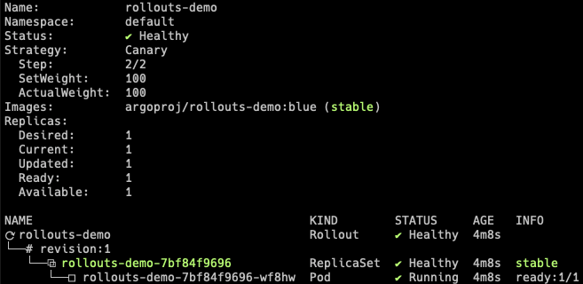
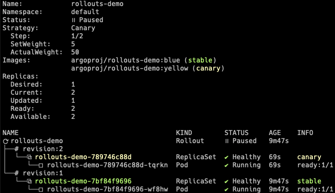
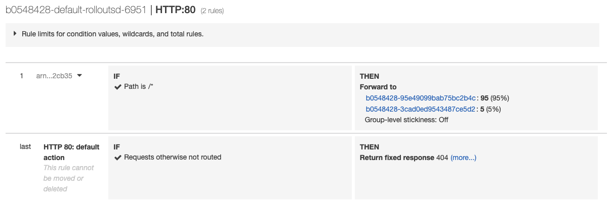

# Getting Started - AWS Load Balancer Controller

This guide covers how Argo Rollouts integrates with the
[AWS Load Balancer Controller](https://kubernetes-sigs.github.io/aws-load-balancer-controller/latest/) 
for traffic shaping. This guide builds upon the concepts of the [basic getting started guide](../../getting-started.md).

## Requirements
- Kubernetes cluster with AWS ALB Ingress Controller installed

!!! tip

    See the [Load Balancer Controller Installation instructions](https://kubernetes-sigs.github.io/aws-load-balancer-controller/latest/deploy/installation/)
    on how to install the AWS Load Balancer Controller

## 1. Deploy the Rollout, Services, and Ingress

When an AWS ALB Ingress is used as the traffic router, the Rollout canary strategy must define the
following fields:

```yaml
apiVersion: argoproj.io/v1alpha1
kind: Rollout
metadata:
  name: rollouts-demo
spec:
  strategy:
    canary:
      # canaryService and stableService are references to Services which the Rollout will modify
      # to target the canary ReplicaSet and stable ReplicaSet respectively (required).
      canaryService: rollouts-demo-canary
      stableService: rollouts-demo-stable
      trafficRouting:
        alb:
          # The referenced ingress will be injected with a custom action annotation, directing
          # the AWS Load Balancer Controller to split traffic between the canary and stable
          # Service, according to the desired traffic weight (required).
          ingress: rollouts-demo-ingress
          # Reference to a Service that the Ingress must target in one of the rules (optional).
          # If omitted, uses canary.stableService.
          rootService: rollouts-demo-root
          # Service port is the port which the Service listens on (required).
          servicePort: 443
...
```

The Ingress referenced by the Rollout must have a rule which matches one of Rollout services.
This should be `canary.trafficRouting.alb.rootService` (if specified), otherwise the rollout will
use `canary.stableService`.

```yaml
apiVersion: networking.k8s.io/v1beta1
kind: Ingress
metadata:
  name: rollouts-demo-ingress
  annotations:
    kubernetes.io/ingress.class: alb
spec:
  rules:
  - http:
      paths:
      - path: /*
        backend:
          # serviceName must match either: canary.trafficRouting.alb.rootService (if specified),
          # or canary.stableService (if rootService is omitted)
          serviceName: rollouts-demo-root
          # servicePort must be the value: use-annotation
          # This instructs AWS Load Balancer Controller to look to annotations on how to direct traffic
          servicePort: use-annotation
```

During an update, the Ingress will be injected with a
[custom action annotation](https://kubernetes-sigs.github.io/aws-load-balancer-controller/latest/guide/ingress/annotations/#actions),
which directs the ALB to splits traffic between the stable and canary Services referenced by the Rollout.
In this example, those Services are named: `rollouts-demo-stable` and `rollouts-demo-canary` 
respectively.

Run the following commands to deploy:

* A Rollout
* Three Services (root, stable, canary)
* An Ingress

```shell
kubectl apply -f https://raw.githubusercontent.com/argoproj/argo-rollouts/master/docs/getting-started/alb/rollout.yaml
kubectl apply -f https://raw.githubusercontent.com/argoproj/argo-rollouts/master/docs/getting-started/alb/services.yaml
kubectl apply -f https://raw.githubusercontent.com/argoproj/argo-rollouts/master/docs/getting-started/alb/ingress.yaml
```

After applying the manifests you should see the following rollout, services, and ingress resources in the cluster:

```shell
$ kubectl get ro
NAME            DESIRED   CURRENT   UP-TO-DATE   AVAILABLE
rollouts-demo   1         1         1            1

$ kubectl get svc
NAME                   TYPE        CLUSTER-IP       EXTERNAL-IP   PORT(S)        AGE
rollouts-demo-root     NodePort    10.100.16.123    <none>        80:30225/TCP   2m43s
rollouts-demo-canary   NodePort    10.100.16.64     <none>        80:30224/TCP   2m43s
rollouts-demo-stable   NodePort    10.100.146.232   <none>        80:31135/TCP   2m43s

$ kubectl get ingress
NAME                    HOSTS   ADDRESS                                                                       PORTS   AGE
rollouts-demo-ingress   *       b0548428-default-rolloutsd-6951-1972570952.ap-northeast-1.elb.amazonaws.com   80      6m36s
```

```shell
kubectl argo rollouts get rollout rollouts-demo
```




## 2. Perform an update

Update the rollout by changing the image, and wait for it to reach the paused state.

```shell
kubectl argo rollouts set image rollouts-demo rollouts-demo=argoproj/rollouts-demo:yellow
kubectl argo rollouts get rollout rollouts-demo
```



At this point, both the canary and stable version of the Rollout are running, with 5% of the
traffic directed to the canary. To understand how this works, inspect the listener rules for 
the ALB. When looking at the listener rules, we see that the forward action weights 
have been modified by the controller to reflect the current weight of the canary.



The controller has added `rollouts-pod-template-hash` selector to the Services and 
attached the same label to the Pods. Therefore, you can split the traffic by simply 
forwarding the requests to the Services according to the weights.
 
As the Rollout progresses through steps, the forward action weights will be adjusted to
match the current setWeight of the steps.
