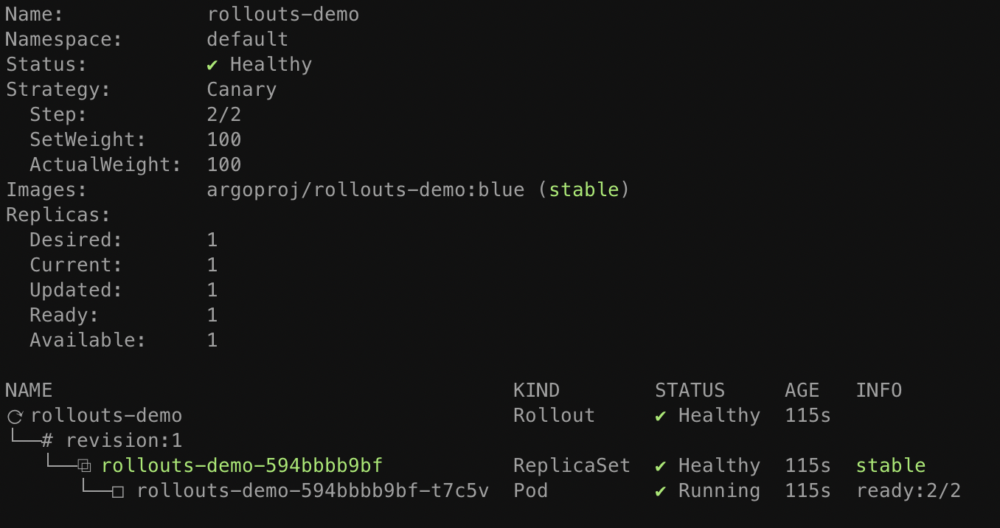
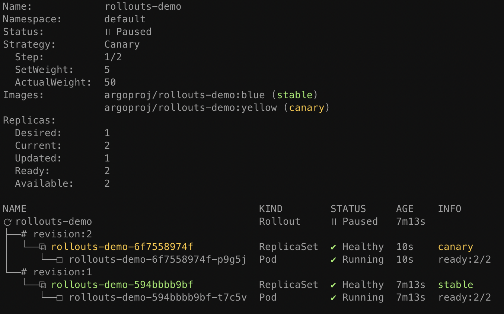

# Getting Started - Istio

This guide covers how Argo Rollouts integrates with the [Istio Service Mesh](https://istio.io/)
for traffic shaping.
This guide builds upon the concepts of the [basic getting started guide](../../getting-started.md).

## Requirements
- Kubernetes cluster with Istio installed

!!! tip
    See the [environment setup guide for Istio](../setup/index.md#istio-setup) on how to setup a
    local minikube environment with Istio

## 1. Deploy the Rollout, Services, Istio VirtualService, and Istio Gateway

When Istio is used as the traffic router, the Rollout canary strategy must define the following
mandatory fields:

```yaml
apiVersion: argoproj.io/v1alpha1
kind: Rollout
metadata:
  name: rollouts-demo
spec:
  strategy:
    canary:
      # Reference to a Service which the controller updates to point to the canary ReplicaSet
      canaryService: rollouts-demo-canary
      # Reference to a Service which the controller updates to point to the stable ReplicaSet
      stableService: rollouts-demo-stable
      trafficRouting:
        istio:
          virtualServices:
          # One or more virtualServices can be configured
          # Reference to a VirtualService which the controller updates with canary weights
          - name: rollouts-demo-vsvc1
            # Optional if there is a single HTTP route in the VirtualService, otherwise required
            routes:
            - http-primary
            # Optional if there is a single HTTPS/TLS route in the VirtualService, otherwise required
            tlsRoutes:
            # Below fields are optional but if defined, they should match exactly with at least one of the TLS route match rules in your VirtualService
            - port: 443 # Only required if you want to match any rule in your VirtualService which contains this port
              # Only required if you want to match any rule in your VirtualService which contain all these SNI hosts
              sniHosts:
              - reviews.bookinfo.com
              - localhost
          - name: rollouts-demo-vsvc2
            # Optional if there is a single HTTP route in the VirtualService, otherwise required
            routes:
              - http-secondary
            # Optional if there is a single HTTPS/TLS route in the VirtualService, otherwise required
            tlsRoutes:
              # Below fields are optional but if defined, they should match exactly with at least one of the TLS route match rules in your VirtualService
              - port: 443 # Only required if you want to match any rule in your VirtualService which contains this port
                # Only required if you want to match any rule in your VirtualService which contain all these SNI hosts
                sniHosts:
                  - reviews.bookinfo.com
                  - localhost
            tcpRoutes:
              # Below fields are optional but if defined, they should match exactly with at least one of the TCP route match rules in your VirtualService
              - port: 8020 # Only required if you want to match any rule in your VirtualService which contains this port
```

The VirtualService and route referenced in either `trafficRouting.istio.virtualService` or
`trafficRouting.istio.virtualServices`. `trafficRouting.istio.virtualServices` helps in adding
one or more virtualServices unlike `trafficRouting.istio.virtualService` where only single virtualService can be added.
This is required to have either HTTP, TLS, TCP or a mixed route specs that splits between the stable and the canary
services referenced in the rollout. If the route is HTTPS/TLS, we can match it based on the
given port number and/or SNI hosts. Note that both of them are optional and only needed if you
want to match any rule in your VirtualService which contains these.

In this guide, the two services are: `rollouts-demo-stable` and `rollouts-demo-canary` respectively.
The weights for these two services should initially be set to 100% on the stable service and 0% on
the canary service. During an update, these values will get modified by the controller.
If there are multiple VirtualService then weight values for stable and canary service of each VirtualService
will be modified by the controller simultaneously.

Note that since we have both the HTTP and HTTPS routes in our rollout spec and they match the
VirtualService specs, weights will get modified for both these routes.

```yaml
apiVersion: networking.istio.io/v1alpha3
kind: VirtualService
metadata:
  name: rollouts-demo-vsvc1
spec:
  gateways:
  - rollouts-demo-gateway
  hosts:
  - rollouts-demo-vsvc1.local
  http:
  - name: http-primary  # Should match rollout.spec.strategy.canary.trafficRouting.istio.virtualServices.routes
    route:
    - destination:
        host: rollouts-demo-stable  # Should match rollout.spec.strategy.canary.stableService
        port:
          number: 15372
      weight: 100
    - destination:
        host: rollouts-demo-canary  # Should match rollout.spec.strategy.canary.canaryService
        port:
          number: 15372
      weight: 0
  tls:
  - match:
    - port: 443  # Should match the port number of the route defined in rollout.spec.strategy.canary.trafficRouting.istio.virtualServices.tlsRoutes
      sniHosts: # Should match all the SNI hosts of the route defined in rollout.spec.strategy.canary.trafficRouting.istio.virtualServices.tlsRoutes
      - reviews.bookinfo.com
      - localhost
    route:
    - destination:
        host: rollouts-demo-stable  # Should match rollout.spec.strategy.canary.stableService
      weight: 100
    - destination:
        host: rollouts-demo-canary  # Should match rollout.spec.strategy.canary.canaryService
      weight: 0
  tcp:
  - match:
      - port: 8020 # Should match the port number of the route defined in rollout.spec.strategy.canary.trafficRouting.istio.virtualServices.tcpRoutes
    route:
    - destination:
        host: rollouts-demo-stable # Should match rollout.spec.strategy.canary.stableService
      weight: 100
    - destination:
        host: rollouts-demo-canary # Should match rollout.spec.strategy.canary.canaryService
      weight: 0
```

```yaml
apiVersion: networking.istio.io/v1alpha3
kind: VirtualService
metadata:
  name: rollouts-demo-vsvc2
spec:
  gateways:
  - rollouts-demo-gateway
  hosts:
  - rollouts-demo-vsvc2.local
  http:
  - name: http-secondary  # Should match rollout.spec.strategy.canary.trafficRouting.istio.virtualServices.routes
    route:
    - destination:
        host: rollouts-demo-stable  # Should match rollout.spec.strategy.canary.stableService
        port:
          number: 15373
      weight: 100
    - destination:
        host: rollouts-demo-canary  # Should match rollout.spec.strategy.canary.canaryService
        port:
          number: 15373
      weight: 0
  tls:
  - match:
    - port: 443  # Should match the port number of the route defined in rollout.spec.strategy.canary.trafficRouting.istio.virtualServices.tlsRoutes
      sniHosts: # Should match all the SNI hosts of the route defined in rollout.spec.strategy.canary.trafficRouting.istio.virtualServices.tlsRoutes
      - reviews.bookinfo.com
    route:
    - destination:
        host: rollouts-demo-stable  # Should match rollout.spec.strategy.canary.stableService
      weight: 100
    - destination:
        host: rollouts-demo-canary  # Should match rollout.spec.strategy.canary.canaryService
      weight: 0
  tcp:
  - match:
    - port: 8020  # Should match the port number of the route defined in rollout.spec.strategy.canary.trafficRouting.istio.virtualServices.tcpRoutes
    route:
    - destination:
        host: rollouts-demo-stable  # Should match rollout.spec.strategy.canary.stableService
      weight: 100
    - destination:
        host: rollouts-demo-canary  # Should match rollout.spec.strategy.canary.canaryService
      weight: 0
```

Run the following commands to deploy:

* A Rollout
* Two Services (stable and canary)
* One or more Istio VirtualServices
* An Istio Gateway

```shell
kubectl apply -f https://raw.githubusercontent.com/argoproj/argo-rollouts/master/docs/getting-started/istio/rollout.yaml
kubectl apply -f https://raw.githubusercontent.com/argoproj/argo-rollouts/master/docs/getting-started/istio/services.yaml
kubectl apply -f https://raw.githubusercontent.com/argoproj/argo-rollouts/master/docs/getting-started/istio/multipleVirtualsvc.yaml
kubectl apply -f https://raw.githubusercontent.com/argoproj/argo-rollouts/master/docs/getting-started/istio/gateway.yaml
```

After applying the manifests you should see the following rollout, services, virtualservices,
and gateway resources in the cluster:

```shell
$ kubectl get ro
NAME            DESIRED   CURRENT   UP-TO-DATE   AVAILABLE
rollouts-demo   1         1         1            1

$ kubectl get svc
NAME                   TYPE        CLUSTER-IP       EXTERNAL-IP   PORT(S)   AGE
rollouts-demo-canary   ClusterIP   10.103.146.137   <none>        80/TCP    37s
rollouts-demo-stable   ClusterIP   10.101.158.227   <none>        80/TCP    37s

$ kubectl get virtualservice
NAME                  GATEWAYS                  HOSTS                         AGE
rollouts-demo-vsvc1   [rollouts-demo-gateway]   [rollouts-demo-vsvc1.local]   54s
rollouts-demo-vsvc2   [rollouts-demo-gateway]   [rollouts-demo-vsvc2.local]   54s

$ kubectl get gateway
NAME                    AGE
rollouts-demo-gateway   71s
```

```shell
kubectl argo rollouts get rollout rollouts-demo
```




## 2. Perform an update

Update the rollout by changing the image, and wait for it to reached the paused state.

```shell
kubectl argo rollouts set image rollouts-demo rollouts-demo=argoproj/rollouts-demo:yellow
kubectl argo rollouts get rollout rollouts-demo
```



At this point, both the canary and stable version of the Rollout are running, with 5% of the
traffic directed to the canary. To understand how this works, inspect the VirtualService which
the Rollout was referencing. When looking at both the VirtualService, we see that the route destination
weights have been modified by the controller to reflect the current weight of the canary.

```yaml
apiVersion: networking.istio.io/v1beta1
kind: VirtualService
metadata:
  name: rollouts-demo-vsvc1
  namespace: default
spec:
  gateways:
  - rollouts-demo-gateway
  hosts:
  - rollouts-demo-vsvc1.local
  http:
  - name: http-primary
    route:
    - destination:
        host: rollouts-demo-stable
        port:
          number: 15372
      weight: 95
    - destination:
        host: rollouts-demo-canary
        port:
          number: 15372
      weight: 5
  tls:
  - match:
    - port: 443
      sniHosts:
      - reviews.bookinfo.com
      - localhost
    route:
    - destination:
        host: rollouts-demo-stable
      weight: 95
    - destination:
        host: rollouts-demo-canary
      weight: 5
  tcp:
  - match:
    - port: 8020
    route:
    - destination:
        host: rollouts-demo-stable
      weight: 95
    - destination:
        host: rollouts-demo-canary
      weight: 5
```

```yaml
apiVersion: networking.istio.io/v1beta1
kind: VirtualService
metadata:
  name: rollouts-demo-vsvc2
  namespace: default
spec:
  gateways:
  - rollouts-demo-gateway
  hosts:
  - rollouts-demo-vsvc2.local
  http:
  - name: http-primary
    route:
    - destination:
        host: rollouts-demo-stable
        port:
          number: 15373
      weight: 95
    - destination:
        host: rollouts-demo-canary
        port:
          number: 15373
      weight: 5
  tls:
  - match:
    - port: 443
      sniHosts:
      - reviews.bookinfo.com
    route:
    - destination:
        host: rollouts-demo-stable
      weight: 95
    - destination:
        host: rollouts-demo-canary
      weight: 5
  tcp:
  - match:
    - port: 8020
    route:
    - destination:
        host: rollouts-demo-stable
      weight: 95
    - destination:
        host: rollouts-demo-canary
      weight: 5
```

As the Rollout progresses through steps, the HTTP, TLS, and/or TCP route(s) destination weights will be
adjusted to match the current `setWeight` of the steps.
