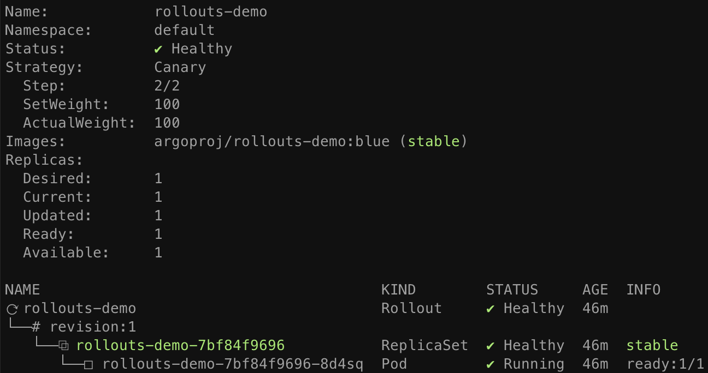

# Getting Started - NGINX Ingress

This guide covers how Argo Rollouts integrates with the
[NGINX Ingress Controller](https://github.com/kubernetes/ingress-nginx) for traffic shaping. 
This guide builds upon the concepts of the [basic getting started guide](../../getting-started.md).

## Requirements
- Kubernetes cluster with NGINX ingress controller installed

!!! tip
    See the [environment setup guide for NGINX](../setup/index.md#nginx-ingress-controller-setup)
    on how to setup a local minikube environment with nginx.

## 1. Deploy the Rollout, Services, and Ingress

When NGINX Ingress is used as the traffic router, the Rollout canary strategy must define
the following mandatory fields:

```yaml
apiVersion: argoproj.io/v1alpha1
kind: Rollout
metadata:
  name: rollouts-demo
spec:
  strategy:
    canary:
      # Reference to a Service which the controller will update to point to the canary ReplicaSet
      canaryService: rollouts-demo-canary
      # Reference to a Service which the controller will update to point to the stable ReplicaSet
      stableService: rollouts-demo-stable
      trafficRouting:
        nginx:
          # Reference to an Ingress which has a rule pointing to the stable service (e.g. rollouts-demo-stable)
          # This ingress will be cloned with a new name, in order to achieve NGINX traffic splitting.
          stableIngress: rollouts-demo-stable
...
```

The Ingress referenced in `canary.trafficRouting.nginx.stableIngress` is required to have a host
rule which has a backend targeting the Service referenced under `canary.stableService`.
In our example, that stable Service is named: `rollouts-demo-stable`:

```yaml
apiVersion: networking.k8s.io/v1beta1
kind: Ingress
metadata:
  name: rollouts-demo-stable
  annotations:
    kubernetes.io/ingress.class: nginx
spec:
  rules:
  - host: rollouts-demo.local
    http:
      paths:
      - path: /
        backend:
          # Reference to a Service name, also specified in the Rollout spec.strategy.canary.stableService field
          serviceName: rollouts-demo-stable
          servicePort: 80
```

Run the following commands to deploy:

* A Rollout
* Two Services (stable and canary)
* An Ingress

```shell
kubectl apply -f https://raw.githubusercontent.com/argoproj/argo-rollouts/master/docs/getting-started/nginx/rollout.yaml
kubectl apply -f https://raw.githubusercontent.com/argoproj/argo-rollouts/master/docs/getting-started/nginx/services.yaml
kubectl apply -f https://raw.githubusercontent.com/argoproj/argo-rollouts/master/docs/getting-started/nginx/ingress.yaml
```

After applying the manifests you should see the following rollout, services, and ingress resources
in the cluster:

```shell
$ kubectl get ro
NAME            DESIRED   CURRENT   UP-TO-DATE   AVAILABLE
rollouts-demo   1         1         1            1

$ kubectl get svc
NAME                   TYPE        CLUSTER-IP      EXTERNAL-IP   PORT(S)   AGE
rollouts-demo-canary   ClusterIP   10.96.6.241     <none>        80/TCP    33s
rollouts-demo-stable   ClusterIP   10.102.229.83   <none>        80/TCP    33s

$ kubectl get ing
NAME                                        CLASS    HOSTS                 ADDRESS        PORTS   AGE
rollouts-demo-stable                        <none>   rollouts-demo.local   192.168.64.2   80      36s
rollouts-demo-rollouts-demo-stable-canary   <none>   rollouts-demo.local   192.168.64.2   80      35s
```

You should also notice a second ingress created by the rollouts controller,
`rollouts-demo-rollouts-demo-stable-canary`. This ingress is the "canary ingress", which is a
clone of the user-managed Ingress referenced under `nginx.stableIngress`. It is used by nginx
ingress controller to achieve canary traffic splitting. The name of the generated ingress is
formulated using `<ROLLOUT-NAME>-<INGRESS-NAME>-canary`. More details on the second Ingress are
discussed in the following section.

```shell
kubectl argo rollouts get rollout rollouts-demo
```




## 2. Perform an update

Update the rollout by changing the image, and wait for it to reached the paused state.

```shell
kubectl argo rollouts set image rollouts-demo rollouts-demo=argoproj/rollouts-demo:yellow
kubectl argo rollouts get rollout rollouts-demo
```


At this point, both the canary and stable version of the Rollout are running, with 5% of the
traffic directed to the canary. One thing to note, is that the rollout is able to achieve a
5% canary weight despite only running two pods. This is able to be achieved since the traffic split
happens at the ingress controller (as opposed to weighted replica counts and kube-proxy in the
basic guide).

When inspecting the rollout controller generated Ingress copy, we see that it has the following
changes over the original ingress:

1. Two additional
[NGINX specific canary annotations](https://kubernetes.github.io/ingress-nginx/user-guide/nginx-configuration/annotations/#canary)
are added to the annotations.
2. The Ingress rules will have an rule which points the backend to the *canary* service.


```yaml
apiVersion: extensions/v1beta1
kind: Ingress
metadata:
  name: rollouts-demo-rollouts-demo-stable-canary
  annotations:
    kubernetes.io/ingress.class: nginx
    nginx.ingress.kubernetes.io/canary: "true"
    nginx.ingress.kubernetes.io/canary-weight: "5"
spec:
  rules:
  - host: rollouts-demo.local
    http:
      paths:
      - backend:
          serviceName: rollouts-demo-canary
          servicePort: 80
```

As the Rollout progresses through steps, the `canary-weight` annotation will be adjusted to match
the current setWeight of the steps. The NGINX ingress controller examines the original Ingress,
the canary Ingress, and the canary-weight annotation to determine what percentage of traffic to
split between the two Ingresses.
