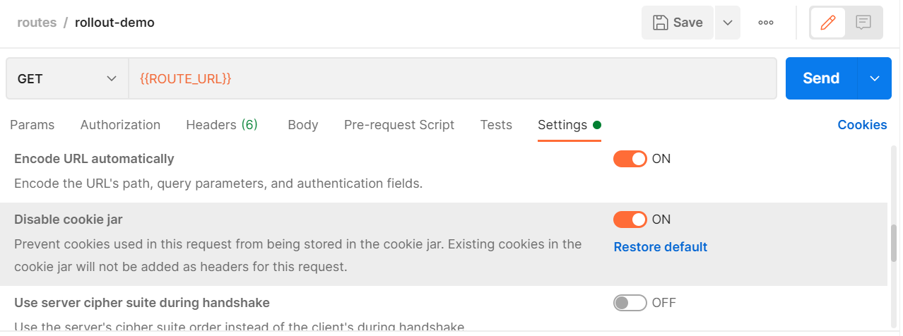
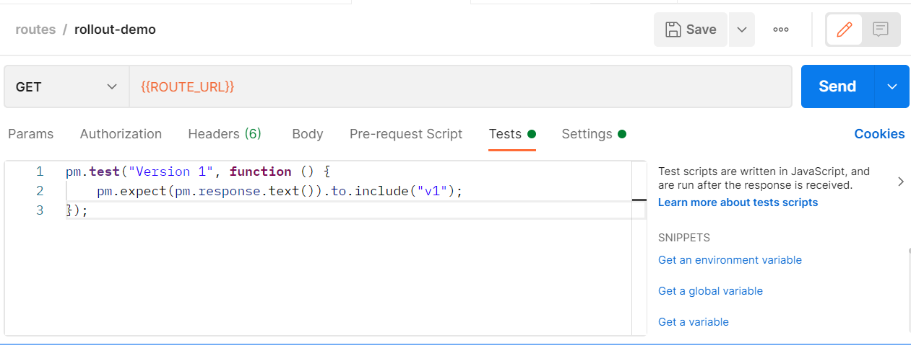
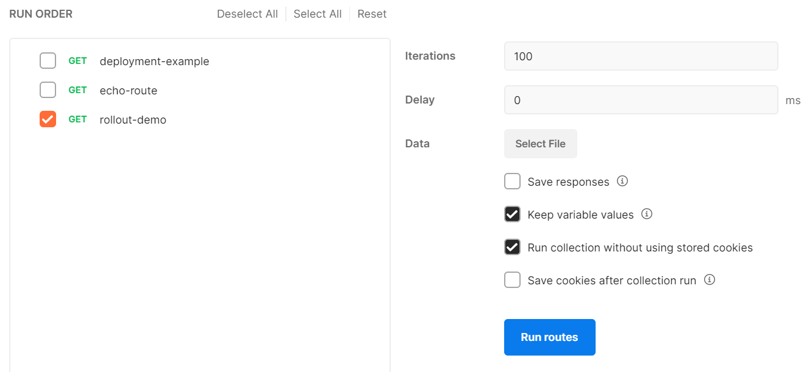
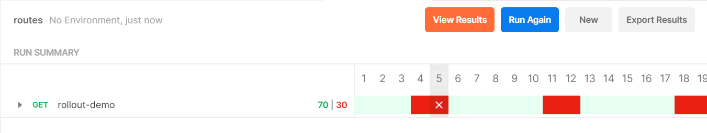

# Getting Started - OpenShift Routing

This guide covers how Argo Rollouts integrates with
[OpenShift Routing](https://docs.openshift.com/enterprise/3.0/architecture/core_concepts/routes.html) 
for traffic management. This guide builds upon the concepts of the [basic getting started guide](../../getting-started.md).

## Requirements
- OpenShift cluster with support for routes
- Argo Rollouts installed and running ([installation](../installation.md))

!!! tip
    Make sure you are either switched to the correct namespace or you specify the namespace to be used in the following examples. It is assumed you are working on the `argo-rollouts` namespace from the installation guide.

## 1. Create Kubernetes Services

The following will create two service resources named `stable-service` and `canary-service`:

```yaml
apiVersion: v1
kind: Service
metadata:
  labels:
    app: deployment-example
  name: stable-service
  namespace: argo-rollouts
spec:
  type: ClusterIP
  ports:
  - name: 8080-tcp
    port: 8080
    protocol: TCP
    targetPort: 8080
  selector:
    app: deployment-example
---
apiVersion: v1
kind: Service
metadata:
  labels:
    app: deployment-example
  name: canary-service
spec:
  type: ClusterIP
  ports:
  - name: 8080-tcp
    port: 8080
    protocol: TCP
    targetPort: 8080
  selector:
    app: deployment-example 
```
```shell
oc apply -f https://raw.githubusercontent.com/argoproj/argo-rollouts/master/docs/getting-started/openshift/services.yaml
```

## 2. Create OpenShift Route

Easiest way to create a new route is to expose the `stable-service` through the OpenShift CLI tool:
```shell
oc expose service stable-service
```

This will create a new route named `stable-service` that will expose the service on a public URL.

Alternatively, create and apply a route of your own:
```yaml
apiVersion: route.openshift.io/v1
kind: Route
metadata:
  labels:
    app: deployment-example
  name: stable-service
  namespace: argo-rollouts
spec:
  port:
    targetPort: 8080-tcp
  to:
    kind: Service
    name: stable-service
    weight: 100
```
```shell
oc apply -f https://raw.githubusercontent.com/argoproj/argo-rollouts/master/docs/getting-started/openshift/route.yaml
```

The URL can be found through the CLI under `Requested Host`:
```shell
oc describe route stable-service
```
 
## 3. Create Argo Rollout

You must define at least one route under the routes field:

```yaml
apiVersion: argoproj.io/v1alpha1
kind: Rollout
metadata:
  name: openshift-rollout-demo
  namespace: argo-rollouts
spec:
  replicas: 5
  revisionHistoryLimit: 2
  selector:
    matchLabels:
      app: deployment-example
  template:
    metadata:
      labels:
        app: deployment-example
    spec:
      containers:
        - image: openshift/deployment-example:v1
          imagePullPolicy: Always
          name: deployment-example-v1
          ports:
            - containerPort: 8080
  strategy:
    canary:
      stableService: stable-service
      canaryService: canary-service
      trafficRouting:
        openshift:
          routes:
            - stable-service # Enter one or multiple routes
      steps:
      - setWeight: 30
      - pause: {}
      - setWeight: 60
      - pause: {duration: 30s}
      - setWeight: 100
      - pause: {duration: 10s}
```
```shell
oc apply -f https://raw.githubusercontent.com/argoproj/argo-rollouts/master/docs/getting-started/openshift/rollout.yaml
```
Now, assuming you have the Argo Rollouts CLI plugin, you can observe the rollout and make sure it is successfully deployed using the web interface:
```shell
oc argo rollouts dashboard
```
And navigate to http://localhost:3100

Alternatively, watch the rollout through the CLI:
```shell
oc argo rollouts get rollout openshift-rollout-demo -w
```

You should see that 5 pods are deployed with version 1 of the deployment-example container under the service `stable-service`. Since this is the first version, the rollout is in a finished state.

## 4. Update Rollout

If you are using the web interface, change the container image in the top right to `openshift/deployment-example:v2`, updating the rollout.

The same can be achieved through CLI:
```shell
oc argo rollouts set image rollouts-demo \
  rollouts-demo=openshift/deployment-example:v2
```

The rollout should begin as normal, changing the traffic weight of the canary service to 30% and the stable service to 70%. This can be confirmed through the following command:

```shell
oc describe route stable-service
```

## 5. Test Rollout

The container image `deployment-example` displays an HTML page with either `v1` or `v2` depending on the tag used.
Requests can be sent to the route URL to see whether the traffic is split properly or not through Postman or `curl`.

Simple example of request for route URL without saving cookies:



Test to see whether request returns version 1 or 2:



Runner to run request 100 times without saving cookies: 



Results from runner, confirming traffic weights (green is v1, red is v2):



The rollout can be promoted through the CLI or web interface, and the runner can be rerun to confirm that traffic is managed till the end of the rollout.