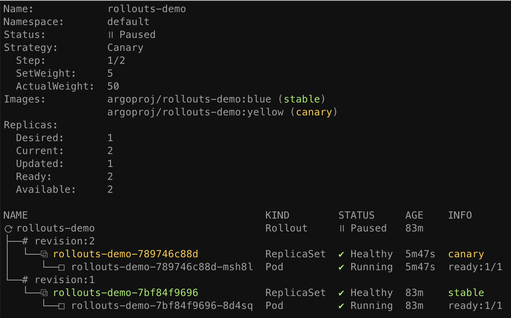

# Getting Started - SMI (Service Mesh Interface)

!!! important
    Available since v0.9

This guide covers how Argo Rollouts integrates with the Service Mesh Interface (SMI), using
[Linkerd](https://linkerd.io) and 
[NGINX Ingress Controller](https://github.com/kubernetes/ingress-nginx) for traffic shaping. 
Since the SMI TrafficSplit resource is supported by multiple service mesh providers, the concepts
taught here are applicable to other service mesh providers that support the interface. See 
the [SMI Ecosystem](https://github.com/servicemeshinterface/smi-spec#ecosystem) for other
projects that support SMI.
This guide builds upon the concepts of the [basic getting started guide](../../getting-started.md).

## Requirements
- Kubernetes cluster with Linkerd installed
- Kubernetes cluster with NGINX ingress controller installed and part of the mesh

!!! tip
    See the [environment setup guide for linkerd](../setup/index.md#linkerd-setup)
    on how to setup a local minikube environment with linkerd and nginx.

## 1. Deploy the Rollout, Services, and Ingress

When SMI is used as the traffic router, the Rollout canary strategy must define
the following mandatory fields:

```yaml
apiVersion: argoproj.io/v1alpha1
kind: Rollout
metadata:
  name: rollouts-demo
spec:
  strategy:
    canary:
      # Reference to a Service which the controller will update to point to the canary ReplicaSet
      canaryService: rollouts-demo-canary
      # Reference to a Service which the controller will update to point to the stable ReplicaSet
      stableService: rollouts-demo-stable
      trafficRouting:
        smi: {}
```

Run the following commands to deploy:

* A Rollout with the Linkerd `linkerd.io/inject: enabled` annotation
* Two Services (stable and canary)
* An Ingress

```shell
kubectl apply -f https://raw.githubusercontent.com/argoproj/argo-rollouts/master/docs/getting-started/smi/rollout.yaml
kubectl apply -f https://raw.githubusercontent.com/argoproj/argo-rollouts/master/docs/getting-started/smi/services.yaml
kubectl apply -f https://raw.githubusercontent.com/argoproj/argo-rollouts/master/docs/getting-started/smi/ingress.yaml
```

After applying the manifests you should see the following rollout, services, and ingress resources
in the cluster:

```shell
$ kubectl get ro
NAME            DESIRED   CURRENT   UP-TO-DATE   AVAILABLE
rollouts-demo   1         2         1            2

$ kubectl get svc
NAME                   TYPE        CLUSTER-IP       EXTERNAL-IP   PORT(S)   AGE
rollouts-demo-canary   ClusterIP   10.111.69.188    <none>        80/TCP    23m
rollouts-demo-stable   ClusterIP   10.109.175.248   <none>        80/TCP    23m

$ kubectl get ing
NAME                   CLASS    HOSTS                 ADDRESS        PORTS   AGE
rollouts-demo-stable   <none>   rollouts-demo.local   192.168.64.2   80      23m
```

You should also see a TrafficSplit resource which is created automatically and owned by the rollout:

```
$ kubectl get trafficsplit
NAME            SERVICE
rollouts-demo   rollouts-demo-stable
```

When inspecting the generated TrafficSplit resource, the weights are automatically configured to
send 100% traffic to the `rollouts-demo-stable` service, and 0% traffic to the `rollouts-demo-canary`.
These values will be updated during an update.

```yaml
apiVersion: split.smi-spec.io/v1alpha1
kind: TrafficSplit
metadata:
  name: rollouts-demo
  namespace: default
spec:
  backends:
  - service: rollouts-demo-canary
    weight: "0"
  - service: rollouts-demo-stable
    weight: "100"
  service: rollouts-demo-stable
```

## 2. Perform an update

Now perform an update the rollout by changing the image, and wait for it to reached the paused state.

```shell
kubectl argo rollouts set image rollouts-demo rollouts-demo=argoproj/rollouts-demo:yellow
kubectl argo rollouts get rollout rollouts-demo
```



At this point, both the canary and stable version of the Rollout are running, with 5% of the
traffic directed to the canary. When inspecting the TrafficSplit generated by the controller, we see
that the weight has been updated to reflect the current `setWeight: 5` step of the canary deploy.

```yaml
apiVersion: split.smi-spec.io/v1alpha1
kind: TrafficSplit
metadata:
  name: rollouts-demo
  namespace: default
spec:
  backends:
  - service: rollouts-demo-canary
    weight: "5"
  - service: rollouts-demo-stable
    weight: "95"
  service: rollouts-demo-stable
```

As the Rollout progresses through steps, the weights in the TrafficSplit resource will be adjusted
to match the current setWeight of the steps.