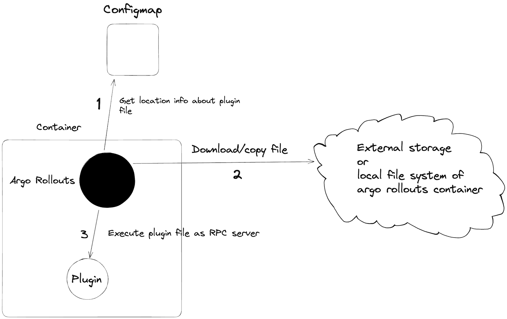

# Creating an Argo Rollouts Plugin

## High Level Overview

Argo Rollouts plugins depend on hashicorp's [go-plugin](https://github.com/hashicorp/go-plugin) library. This library
provides a way for a plugin to be compiled as a standalone executable and then loaded by the rollouts controller at runtime.
This works by having the plugin executable act as a rpc server and the rollouts controller act as a client. The plugin executable
is started by the rollouts controller and is a long-lived process and that the rollouts controller connects to over a unix socket.

Here is an overview of how plugins are loaded:

[](contributing-assets/plugin-loading.png)


The communication protocol uses golang built in net/rpc library so plugins have to be written in golang.

## Plugin Repository

In order to get plugins listed in the main argo rollouts documentation we ask that the plugin repository be created under
the [argoproj-labs](https://github.com/argoproj-labs) organization. Please open an issue under argo-rollouts requesting a
repo which you would be granted admin access on.

There is also a standard naming convention for plugin names used for configmap registration, as well as what the plugin
uses for locating its specific configuration on rollout or analysis resources. The name needs to be in the form of
`<namespace>/<name>` and both <namespace> and <name> have a regular expression check that matches Github's requirements
for `username/org` and `repository name`. This requirement is in place to help with allowing multiple creators of the same plugin
types to exist such as `<org1>/nginx` and `<org2>/nginx`. These names could be based of the repo name such
as `argoproj-labs/rollouts-plugin-metric-sample-prometheus` but it is not a requirement.

There will also be a standard for naming repositories under argoproj-labs in the form of `rollouts-plugin-<type>-<tool>`
where `<type>` is say `metric`, or `trafficrouter` and `<tool>` is the software the plugin is for say nginx.

## Plugin Name

So now that we have an idea on plugin naming and repository standards let's pick a name to use for the rest of this
documentation and call our plugin `argoproj-labs/nginx`.

This name will be used in a few different spots the first is the config map that your plugin users will need to configure.
It looks like this below.

```yaml
kind: ConfigMap
metadata:
  name: argo-rollouts-config
data:
  metricProviderPlugins: |-
    - name: "argoproj-labs/metrics"
      location: "file:///tmp/argo-rollouts/metric-plugin"
  trafficRouterPlugins: |-
    - name: "argoproj-labs/nginx"
      location: "file:///tmp/argo-rollouts/traffic-plugin"
```

As you can see there is a field called `name:` under both `metrics` or `trafficrouters` this is the first place where your
end users will need to configure the name of the plugin. The second location is either in the rollout object or the analysis
template which you can see the examples below.

#### AnalysisTemplate Example
```yaml
apiVersion: argoproj.io/v1alpha1
kind: AnalysisTemplate
metadata:
  name: success-rate
spec:
  metrics:
    - name: success-rate
      ...
      provider:
        plugin:
          argoproj-labs/metrics:
            address: http://prometheus.local
```

#### Traffic Router Example
```yaml
apiVersion: argoproj.io/v1alpha1
kind: Rollout
metadata:
  name: example-plugin-ro
spec:
  strategy:
    canary:
      canaryService: example-plugin-ro-canary-analysis
      stableService: example-plugin-ro-stable-analysis
      trafficRouting:
        plugins:
          argoproj-labs/nginx:
            stableIngress: canary-demo
```

You can see that we use the plugin name under `spec.metrics[].provider.plugin` for analysis template and `spec.strategy.canary.trafficRouting.plugins`
for traffic routers. You as a plugin author can then put any configuration you need under `argoproj-labs/nginx` and you will be able to
look up that config in your plugin via the plugin name key. You will also want to document what configuration options your plugin supports.

## Plugin Interfaces

Argo Rollouts currently supports two plugin systems as a plugin author your end goal is to implement these interfaces as
a hashicorp go-plugin. The two interfaces are `MetricsPlugin` and `TrafficRouterPlugin` for each of the respective plugins:

```go
type MetricProviderPlugin interface {
  // InitPlugin initializes the traffic router plugin this gets called once when the plugin is loaded.
  InitPlugin() RpcError
  // Run start a new external system call for a measurement
  // Should be idempotent and do nothing if a call has already been started
  Run(*v1alpha1.AnalysisRun, v1alpha1.Metric) v1alpha1.Measurement
  // Resume Checks if the external system call is finished and returns the current measurement
  Resume(*v1alpha1.AnalysisRun, v1alpha1.Metric, v1alpha1.Measurement) v1alpha1.Measurement
  // Terminate will terminate an in-progress measurement
  Terminate(*v1alpha1.AnalysisRun, v1alpha1.Metric, v1alpha1.Measurement) v1alpha1.Measurement
  // GarbageCollect is used to garbage collect completed measurements to the specified limit
  GarbageCollect(*v1alpha1.AnalysisRun, v1alpha1.Metric, int) RpcError
  // Type gets the provider type
  Type() string
  // GetMetadata returns any additional metadata which providers need to store/display as part
  // of the metric result. For example, Prometheus uses is to store the final resolved queries.
  GetMetadata(metric v1alpha1.Metric) map[string]string
}

type TrafficRouterPlugin interface {
  // InitPlugin initializes the traffic router plugin this gets called once when the plugin is loaded.
  InitPlugin() RpcError
  // UpdateHash informs a traffic routing reconciler about new canary, stable, and additionalDestination(s) pod hashes
  UpdateHash(rollout *v1alpha1.Rollout, canaryHash, stableHash string, additionalDestinations []v1alpha1.WeightDestination) RpcError
  // SetWeight sets the canary weight to the desired weight
  SetWeight(rollout *v1alpha1.Rollout, desiredWeight int32, additionalDestinations []v1alpha1.WeightDestination) RpcError
  // SetHeaderRoute sets the header routing step
  SetHeaderRoute(rollout *v1alpha1.Rollout, setHeaderRoute *v1alpha1.SetHeaderRoute) RpcError
  // SetMirrorRoute sets up the traffic router to mirror traffic to a service
  SetMirrorRoute(rollout *v1alpha1.Rollout, setMirrorRoute *v1alpha1.SetMirrorRoute) RpcError
  // VerifyWeight returns true if the canary is at the desired weight and additionalDestinations are at the weights specified
  // Returns nil if weight verification is not supported or not applicable
  VerifyWeight(rollout *v1alpha1.Rollout, desiredWeight int32, additionalDestinations []v1alpha1.WeightDestination) (RpcVerified, RpcError)
  // RemoveManagedRoutes Removes all routes that are managed by rollouts by looking at spec.strategy.canary.trafficRouting.managedRoutes
  RemoveManagedRoutes(ro *v1alpha1.Rollout) RpcError
  // Type returns the type of the traffic routing reconciler
  Type() string
}
```

## Plugin Init Function

Each plugin interface has a `InitPlugin` function, this function is called when the plugin is first started up and is only called
once per startup. The `InitPlugin` function is used as a means to initialize the plugin it gives you the plugin author the ability
to either set up a client for a specific metrics provider or in the case of a traffic router construct a client or informer
for kubernetes api. The one thing to note about this though is because these calls happen over RPC the plugin author should
not depend on state being stored in the plugin struct as it will not be persisted between calls.

## Kubernetes RBAC

The plugin runs as a child process of the rollouts controller and as such it will inherit the same RBAC permissions as the
controller. This means that the service account for the rollouts controller will need the correct permissions for the plugin
to function. This might mean instructing users to create a role and role binding to the standard rollouts service account
for the plugin to use. This will probably affect traffic router plugins more than metrics plugins.

## Sample Plugins

There are two sample plugins within the argo-rollouts repo that you can use as a reference for creating your own plugin.

* [Metrics Plugin Sample](https://github.com/argoproj/argo-rollouts/tree/master/test/cmd/metrics-plugin-sample)
* [Traffic Router Plugin Sample](https://github.com/argoproj/argo-rollouts/tree/master/test/cmd/trafficrouter-plugin-sample)
