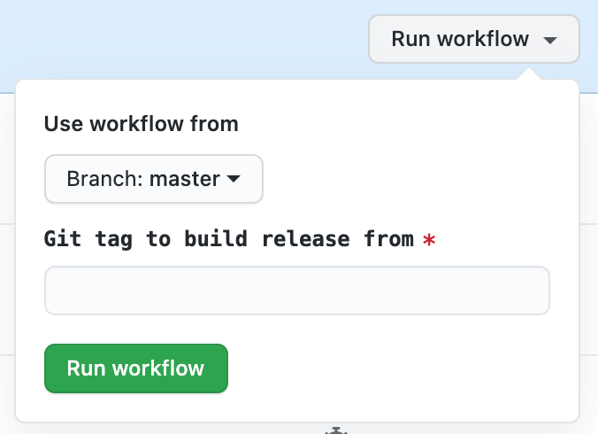

# Releasing

1. Tag a commit to release from using semantic versioning (e.g. v1.0.0-rc1)

1. Visit the [Release GitHub Action](https://github.com/argoproj/argo-rollouts/actions/workflows/release.yaml)
   and enter the tag.

1. To automatically update the stable tag, select `Update stable tag`. (false by default)

[](release-action.png)

1. When the action completes, visit the generated draft [Github releases](https://github.com/argoproj/argo-rollouts/releases) and enter the details about the release:
   * Getting started (copy from previous release and new version)
   * Changelog

1. Update Brew formula:

   * Fork the repo https://github.com/argoproj/homebrew-tap
   * Run the following commands to update the brew formula:
    ```bash
    cd homebrew-tap
    ./update.sh kubectl-argo-rollouts $VERSION
    ```
   * If there is a new minor version we want to update the versioned formula as well:
     * Run the following commands to update the versioned brew formula:
          ```bash
          ./update.sh kubectl-argo-rollouts $VERSION @<version_without_patch_and_v>
          ```
     * Example: If the new version is `v1.3.2`, we want to update the formula for `v1.3` as well.
         ```bash
         ./update.sh kubectl-argo-rollouts v1.3.2 @1.3
         ```
   * Commit and push the changes to your fork
     ```bash
     git commit -am "Update kubectl-argo-rollouts to $VERSION"
     ```
   * Create a PR with the modified files pointing to upstream/master
   * Once the PR is approved by a maintainer, it can be merged.

### Verify

1. Install locally using the command below and follow the [Getting Started Guide](https://argo-rollouts.readthedocs.io/en/stable/getting-started/):

    ```bash
    kubectl apply -n argo-rollouts -f https://github.com/argoproj/argo-rollouts/releases/download/${VERSION}/install.yaml
    ```


1. Check the Kubectl Argo Rollout plugin:
    ```bash
    brew upgrade kubectl-argo-rollouts
    kubectl argo rollouts version
    ```
